# LoRaMesher Contributor Guide

**Version**: 1.0  
**Last Updated**: 2025-06-30

This guide provides comprehensive information for developers who want to contribute to the LoRaMesher project. Whether you're fixing bugs, adding features, or improving documentation, this guide will help you understand the codebase and development workflow.

## Table of Contents

1. [Getting Started](#1-getting-started)
2. [Architecture Overview](#2-architecture-overview)
3. [Code Organization](#3-code-organization)
4. [Development Workflow](#4-development-workflow)
5. [Testing Framework](#5-testing-framework)
6. [Key Extension Points](#6-key-extension-points)
7. [Coding Standards](#7-coding-standards)
8. [Contribution Guidelines](#8-contribution-guidelines)
9. [Priority Implementation Areas](#9-priority-implementation-areas)

---

## 1. Getting Started

### 1.1 Prerequisites

**Required Tools:**
- **PlatformIO Core** (latest version)
- **CMake** 3.16+ (for desktop development)
- **Git** (for version control)
- **C++20 compatible compiler** (GCC 10+, Clang 10+)

**Optional Tools:**
- **Visual Studio Code** with PlatformIO extension
- **CLion** for advanced debugging
- **Doxygen** for documentation generation

### 1.2 Quick Setup

```bash
# Clone repository
git clone <repository-url>
cd loramesher

# Build for desktop testing
mkdir build && cd build
cmake .. -DBUILD_DESKTOP=ON
cmake --build . --target run_all_tests

# Build for ESP32
pio run

# Run native tests
pio test -e test_native
```

### 1.3 Project Structure Overview

```
loramesher/
├── src/                    # Main library source code
│   ├── protocols/          # Protocol implementations
│   ├── hardware/           # Hardware abstraction layer
│   ├── types/              # Message types and configurations
│   └── os/                 # RTOS abstraction
├── include/                # Public header files
├── test/                   # Comprehensive test suite
├── examples/               # Usage examples
├── docs/                   # Technical documentation
├── scripts/                # Build and utility scripts
├── platformio.ini          # PlatformIO configuration
├── CMakeLists.txt          # CMake build configuration
└── CLAUDE.md               # AI assistant instructions
```

---

## 2. Architecture Overview

### 2.1 Design Philosophy

LoRaMesher follows these architectural principles:

- **Service-Oriented Architecture**: Functionality is organized into distinct services
- **Dependency Injection**: Components receive dependencies rather than creating them
- **Builder Pattern**: Fluent configuration and object creation
- **RAII**: Resource management with automatic cleanup
- **Interface Segregation**: Clean abstractions with minimal dependencies

### 2.2 Core Architecture Layers


### 2.3 Detailed Service Architecture

This diagram shows the detailed interactions between services within the LoRaMesh protocol:

```mermaid
graph TB
    subgraph "LoRaMeshProtocol Container"
        PCT[ProtocolTaskFunction<br/>Main Coordination Loop]
        
        subgraph "Core Services"
            NS[NetworkService<br/>• Routing tables<br/>• Route discovery<br/>• Link quality]
            SS[SuperframeService<br/>• TDMA coordination<br/>• Slot management<br/>• Time sync]
            MQS[MessageQueueService<br/>• Message buffering<br/>• Priority queuing<br/>• Slot-based dispatch]
        end
        
        subgraph "Support Services"
            MS[MessageService<br/>• Serialization<br/>• Validation<br/>• Type routing]
            CS[ConfigService<br/>• Parameter mgmt<br/>• Validation<br/>• Persistence]
        end
    end
    
    subgraph "Hardware Interface"
        HM[HardwareManager<br/>• Radio control<br/>• GPIO management<br/>• Platform abstraction]
        RADIO[RadioLib<br/>• LoRa PHY<br/>• Modulation<br/>• RF control]
    end
    
    subgraph "RTOS Interface"
        TASK[Task Scheduler<br/>• Protocol task<br/>• Timer callbacks<br/>• Sync primitives]
        QUEUE[Message Queues<br/>• Inter-task comm<br/>• Event delivery<br/>• Buffer management]
    end
    
    %% Main protocol coordination
    PCT --> NS
    PCT --> SS
    PCT --> MQS
    PCT --> MS
    
    %% Service interactions
    NS <--> SS
    NS <--> MQS
    SS <--> MQS
    NS --> MS
    SS --> MS
    MQS --> MS
    
    %% Hardware access
    NS --> HM
    SS --> HM
    MQS --> HM
    HM --> RADIO
    
    %% RTOS integration
    PCT --> TASK
    SS --> TASK
    MQS --> QUEUE
    NS --> QUEUE
    
    %% Configuration
    CS --> NS
    CS --> SS
    CS --> MQS
    
    style PCT fill:#ff9999
    style NS fill:#99ccff
    style SS fill:#99ffcc
    style MQS fill:#ffcc99
    style MS fill:#cc99ff
    style CS fill:#ffff99
    style HM fill:#cccccc
    style TASK fill:#ffccff
```



### 2.4 Service Interaction Patterns

#### 2.4.1 Message Flow Pattern


#### 2.4.2 Route Discovery Pattern


### 2.3 Key Design Patterns

#### 2.3.1 Builder Pattern
Used for configuration and object creation:

```cpp
// Example: LoraMesher configuration
auto loramesher = LoraMesher::Builder()
    .setNodeId(0x1234)
    .setPinConfig(PinConfig::Builder()
        .setSckPin(18)
        .setMisoPin(19)
        .setMosiPin(23)
        .setCsPin(5)
        .setIrqPin(2)
        .setRstPin(14)
        .build())
    .setRadioConfig(RadioConfig::Builder()
        .setFrequency(868.0)
        .setBandwidth(125.0)
        .setSpreadingFactor(7)
        .build())
    .setProtocol(ProtocolType::LORA_MESH)
    .build();
```

#### 2.3.2 Service Pattern
Protocol functionality is organized into services:

```cpp
class LoRaMeshProtocol {
private:
    std::unique_ptr<INetworkService> networkService_;
    std::unique_ptr<ISuperframeService> superframeService_;
    std::unique_ptr<IMessageQueueService> messageQueueService_;
    
public:
    void Initialize() {
        networkService_->Initialize();
        superframeService_->Initialize();
        messageQueueService_->Initialize();
    }
};
```

#### 2.3.3 Factory Pattern
Platform-specific implementations:

```cpp
class HardwareManagerFactory {
public:
    static std::unique_ptr<IHardwareManager> Create(PlatformType platform) {
        switch (platform) {
            case PlatformType::ESP32:
                return std::make_unique<ESP32HardwareManager>();
            case PlatformType::DESKTOP:
                return std::make_unique<MockHardwareManager>();
            default:
                throw std::invalid_argument("Unsupported platform");
        }
    }
};
```

---

## 3. Code Organization

### 3.1 Source Code Structure

#### 3.1.1 Core Library (`src/`)

```
src/
├── loramesher.cpp              # Main API implementation
├── protocols/                  # Protocol implementations
│   ├── lora_mesh_protocol.cpp  # Main mesh protocol
│   ├── ping_pong_protocol.cpp  # Simple P2P protocol
│   ├── protocol_manager.cpp    # Protocol factory/manager
│   └── services/               # Protocol services
│       ├── network_service.cpp         # Routing and network management
│       ├── superframe_service.cpp      # TDMA synchronization
│       └── message_queue_service.cpp   # Message queuing
├── hardware/                   # Hardware abstraction
│   ├── hardware_manager.cpp    # Platform-specific implementations
│   └── hal/                    # Hardware abstraction layer
│       ├── esp32_hal.cpp       # ESP32 implementation
│       └── mock_hal.cpp        # Testing implementation
├── types/                      # Data types and configurations
│   ├── config/                 # Configuration structures
│   ├── message_types/          # Protocol message definitions
│   └── error_types.hpp         # Error handling types
└── os/                         # Operating system abstraction
    └── rtos.hpp                # Task and synchronization primitives
```

#### 3.1.2 Public Interface (`include/`)

```
include/
├── loramesher.hpp              # Main public API
├── config/                     # Configuration builders
│   ├── pin_config.hpp
│   ├── radio_config.hpp
│   └── protocol_config.hpp
└── types/                      # Public type definitions
    ├── message_types.hpp
    └── error_types.hpp
```

#### 3.1.3 Test Suite (`test/`)

```
test/
├── unit/                       # Unit tests
│   ├── test_routing.cpp
│   ├── test_synchronization.cpp
│   └── test_message_handling.cpp
├── integration/                # Integration tests
│   ├── test_protocol_flow.cpp
│   └── test_network_simulation.cpp
├── fixtures/                   # Test infrastructure
│   ├── lora_mesh_test_fixture.hpp
│   └── virtual_network.hpp
└── mocks/                      # Mock implementations
    ├── mock_radio.hpp
    └── mock_hardware_manager.hpp
```

### 3.2 Header File Organization

#### 3.2.1 Public Headers
- **Single responsibility**: Each header serves one clear purpose
- **Minimal dependencies**: Reduce compilation time and coupling
- **Forward declarations**: Use when possible to avoid includes

#### 3.2.2 Private Headers
- **Implementation details**: Keep internal structures private
- **Service interfaces**: Define clean contracts between services
- **Platform abstractions**: Enable cross-platform development

---

## 4. Development Workflow

### 4.1 Development Environment Setup

#### 4.1.1 PlatformIO Development
```bash
# Create new feature branch
git checkout -b feature/new-routing-algorithm

# Build and test on native platform
pio run -e native
pio test -e test_native

# Build for ESP32
pio run -e esp32

# Monitor ESP32 output
pio device monitor
```

#### 4.1.2 CMake Development (Desktop)
```bash
# Configure build
mkdir build && cd build
cmake .. -DBUILD_DESKTOP=ON -DCMAKE_BUILD_TYPE=Debug

# Build specific targets
cmake --build . --target loramesher_lib
cmake --build . --target build_all_tests

# Run tests
cmake --build . --target run_all_tests
ctest --verbose
```

### 4.2 Testing Workflow

#### 4.2.1 Unit Testing
```cpp
// Example unit test structure
TEST_F(NetworkServiceTest, RouteCalculationTest) {
    // Arrange
    auto networkService = createNetworkService();
    RouteEntry route1{destination: 0x1234, hops: 3, linkQuality: 200};
    RouteEntry route2{destination: 0x1234, hops: 2, linkQuality: 150};
    
    // Act
    bool route1Better = networkService->IsBetterRoute(route1, route2);
    
    // Assert
    EXPECT_TRUE(route1Better);  // Fewer hops should win
}
```

#### 4.2.2 Integration Testing
```cpp
// Example integration test
TEST_F(LoRaMeshTestFixture, NetworkDiscoveryTest) {
    // Create network with multiple nodes
    auto network = CreateNetwork(5 /* nodes */);
    
    // Add new node
    auto newNode = CreateNode(0x5678);
    network->AddNode(newNode);
    
    // Verify network discovery
    EXPECT_TRUE(newNode->WaitForNetworkJoin(10000 /* timeout */));
    EXPECT_EQ(network->GetNodeCount(), 6);
}
```

### 4.3 Debugging Workflow

#### 4.3.1 Desktop Debugging
```bash
# Build with debug symbols
cmake .. -DCMAKE_BUILD_TYPE=Debug

# Run with GDB
gdb ./build/test_runner
(gdb) break NetworkService::ProcessRoutingUpdate
(gdb) run
```

#### 4.3.2 ESP32 Debugging
```bash
# Enable detailed logging
pio run -e esp32 -t upload -t monitor

# Use PlatformIO debugger
pio debug --interface=esp-prog
```

---

## 5. Testing Framework

### 5.1 Test Infrastructure

#### 5.1.1 Test Fixture Architecture
The testing framework provides comprehensive mock implementations:

```cpp
class LoRaMeshTestFixture : public ::testing::Test {
protected:
    void SetUp() override {
        // Create virtual network
        virtualNetwork_ = std::make_unique<VirtualNetwork>();
        
        // Setup mock hardware
        mockHardware_ = std::make_unique<MockHardwareManager>();
        
        // Configure test environment
        setupTestEnvironment();
    }
    
    std::unique_ptr<VirtualNetwork> virtualNetwork_;
    std::unique_ptr<MockHardwareManager> mockHardware_;
};
```

#### 5.1.2 Network Simulation
```cpp
class VirtualNetwork {
public:
    // Create network topology
    void CreateMeshTopology(size_t nodeCount);
    void CreateLineTopology(size_t nodeCount);
    void CreateStarTopology(size_t nodeCount);
    
    // Simulate network conditions
    void SetPacketLoss(float lossRate);
    void SetLatency(uint32_t minMs, uint32_t maxMs);
    void PartitionNetwork(const std::vector<uint16_t>& partition1,
                         const std::vector<uint16_t>& partition2);
    
    // Control simulation
    void AdvanceTime(uint32_t milliseconds);
    void ProcessPendingMessages();
};
```

### 5.2 Testing Best Practices

#### 5.2.1 Test Organization
- **Arrange-Act-Assert**: Structure tests clearly
- **Single responsibility**: Each test verifies one behavior
- **Descriptive names**: Test names explain what is being tested
- **Independent tests**: Tests don't depend on each other

#### 5.2.2 Mock Usage
```cpp
// Mock radio behavior
EXPECT_CALL(*mockRadio_, SendMessage(_))
    .Times(3)
    .WillRepeatedly(Return(RadioResult::SUCCESS));

// Verify message content
EXPECT_CALL(*mockRadio_, SendMessage(MessageTypeEq(ROUTING_UPDATE)))
    .WillOnce(SaveArg<0>(&capturedMessage));
```

---

## 6. Key Extension Points

### 6.1 Adding New Message Types

#### 6.1.1 Define Message Structure
```cpp
// In src/types/message_types/
struct CustomDataMessage {
    uint8_t messageType = CUSTOM_DATA_MESSAGE;  // 0x15
    uint16_t sourceNode;
    uint16_t destinationNode;
    uint8_t customField1;
    uint32_t customField2;
    uint8_t payloadLength;
    uint8_t payload[MAX_CUSTOM_PAYLOAD];
    
    // Serialization methods
    std::vector<uint8_t> Serialize() const;
    bool Deserialize(const std::vector<uint8_t>& data);
};
```

#### 6.1.2 Register Message Handler
```cpp
// In protocol service
void RegisterMessageHandlers() {
    messageHandlers_[CUSTOM_DATA_MESSAGE] = 
        [this](const Message& msg) { ProcessCustomDataMessage(msg); };
}

void ProcessCustomDataMessage(const CustomDataMessage& msg) {
    // Handle custom message logic
    if (msg.destinationNode == getNodeId()) {
        // Message for this node
        forwardToApplication(msg);
    } else {
        // Forward to next hop
        forwardMessage(msg);
    }
}
```

### 6.2 Adding New Services

#### 6.2.1 Define Service Interface
```cpp
class ICustomService {
public:
    virtual ~ICustomService() = default;
    virtual void Initialize() = 0;
    virtual void Start() = 0;
    virtual void Stop() = 0;
    virtual void ProcessMessage(const Message& message) = 0;
};
```

#### 6.2.2 Implement Service
```cpp
class CustomService : public ICustomService {
public:
    explicit CustomService(std::shared_ptr<IHardwareManager> hardware)
        : hardwareManager_(hardware) {}
    
    void Initialize() override {
        // Service initialization
        setupServiceState();
    }
    
    void ProcessMessage(const Message& message) override {
        // Handle service-specific messages
        switch (message.GetType()) {
            case CUSTOM_SERVICE_MESSAGE:
                handleCustomMessage(message);
                break;
        }
    }
    
private:
    std::shared_ptr<IHardwareManager> hardwareManager_;
};
```

### 6.3 Adding New Protocols

#### 6.3.1 Implement Protocol Interface
```cpp
class CustomProtocol : public IProtocol {
public:
    void Initialize() override;
    void Start() override;
    void Stop() override;
    void SendMessage(const Message& message) override;
    void ProcessReceivedMessage(const Message& message) override;
    
private:
    std::unique_ptr<ICustomService> customService_;
};
```

#### 6.3.2 Register with Protocol Manager
```cpp
// In ProtocolManager
std::unique_ptr<IProtocol> CreateProtocol(ProtocolType type) {
    switch (type) {
        case ProtocolType::LORA_MESH:
            return std::make_unique<LoRaMeshProtocol>(hardwareManager_);
        case ProtocolType::PING_PONG:
            return std::make_unique<PingPongProtocol>(hardwareManager_);
        case ProtocolType::CUSTOM:
            return std::make_unique<CustomProtocol>(hardwareManager_);
        default:
            throw std::invalid_argument("Unknown protocol type");
    }
}
```

### 6.4 Platform Support

#### 6.4.1 Adding New Platform HAL
```cpp
class NewPlatformHAL : public IHardwareAbstractionLayer {
public:
    // Implement platform-specific radio control
    RadioResult InitializeRadio(const RadioConfig& config) override;
    RadioResult SendMessage(const std::vector<uint8_t>& data) override;
    RadioResult ReceiveMessage(std::vector<uint8_t>& data) override;
    
    // Implement platform-specific timing
    uint32_t GetCurrentTime() override;
    void DelayMs(uint32_t milliseconds) override;
    
    // Implement platform-specific GPIO
    void SetPinMode(uint8_t pin, PinMode mode) override;
    void DigitalWrite(uint8_t pin, bool value) override;
    bool DigitalRead(uint8_t pin) override;
};
```

---

## 7. Coding Standards

### 7.1 Style Guidelines

LoRaMesher follows the **Google C++ Style Guide** with these specifics:

#### 7.1.1 Naming Conventions
```cpp
// Classes and functions: PascalCase
class NetworkService;
void ProcessMessage();

// Variables and members: camelCase
int nodeCount;
std::string messageName;

// Private members: trailing underscore
class Example {
private:
    int privateVariable_;
    std::shared_ptr<IService> service_;
};

// Constants and enums: UPPER_CASE
const int MAX_MESSAGE_SIZE = 255;
enum class MessageType { DATA_MESSAGE = 0x10 };
```

#### 7.1.2 Code Formatting
```cpp
// 4 spaces for indentation (no tabs)
if (condition) {
    doSomething();
    if (nestedCondition) {
        doNestedOperation();
    }
}

// 100 character line limit
void ProcessLongFunctionName(const VeryLongParameterType& parameter1,
                           const AnotherLongType& parameter2,
                           int simpleParameter);

// Braces on same line for functions and classes
class MyClass {
public:
    void MyFunction() {
        // Implementation
    }
};
```

### 7.2 Documentation Standards

#### 7.2.1 Doxygen Comments
```cpp
/**
 * @brief Processes incoming routing update messages
 * 
 * This function analyzes routing updates from neighboring nodes and updates
 * the local routing table if better routes are found. It implements the
 * Bellman-Ford distance-vector algorithm with link quality considerations.
 * 
 * @param message The routing update message to process
 * @param sender The node ID that sent the update
 * @return true if routing table was updated, false otherwise
 * 
 * @throws std::invalid_argument if message format is invalid
 * @throws NetworkException if routing table update fails
 * 
 * @see RouteEntry, CalculateRouteMetric()
 * @since v1.0
 */
bool ProcessRoutingUpdate(const RoutingUpdateMessage& message, uint16_t sender);
```

#### 7.2.2 Code Comments
```cpp
void ProcessMessage() {
    // Validate message integrity before processing
    if (!validateChecksum(message)) {
        return;
    }
    
    // TODO: Add message rate limiting to prevent flooding
    
    switch (message.GetType()) {
        case DATA_MESSAGE:
            // Forward data messages to application layer
            forwardToApplication(message);
            break;
            
        case ROUTING_MESSAGE:
            // Update routing tables with new information
            updateRoutingTable(message);
            break;
    }
}
```

### 7.3 Error Handling

#### 7.3.1 Exception Safety
```cpp
// Use RAII for resource management
class NetworkManager {
public:
    void ProcessMessage(const Message& msg) {
        // Resource automatically cleaned up even if exception thrown
        auto lock = std::lock_guard<std::mutex>(mutex_);
        
        try {
            processMessageImpl(msg);
        } catch (const NetworkException& e) {
            logError("Network processing failed: " + e.what());
            // Resource still cleaned up by lock destructor
        }
    }
};
```

#### 7.3.2 Error Codes vs Exceptions
```cpp
// Use Result<T> for expected errors
enum class NetworkError {
    SUCCESS,
    ROUTE_NOT_FOUND,
    MESSAGE_TOO_LARGE,
    TIMEOUT
};

template<typename T>
using Result = std::variant<T, NetworkError>;

Result<Route> FindRoute(uint16_t destination) {
    auto it = routingTable_.find(destination);
    if (it == routingTable_.end()) {
        return NetworkError::ROUTE_NOT_FOUND;
    }
    return it->second;
}

// Use exceptions for unexpected errors
void InitializeHardware() {
    if (!radio_.Initialize()) {
        throw HardwareException("Failed to initialize radio module");
    }
}
```

---

## 8. Contribution Guidelines

### 8.1 Contributing Process

#### 8.1.1 Development Workflow
1. **Create Issue**: Describe the bug or feature request
2. **Fork Repository**: Create your own fork
3. **Create Branch**: Use descriptive branch names
   - `feature/routing-optimization`
   - `bugfix/memory-leak-in-service`
   - `docs/api-reference-update`
4. **Implement Changes**: Follow coding standards
5. **Add Tests**: Ensure comprehensive test coverage
6. **Update Documentation**: Keep docs current
7. **Submit Pull Request**: Provide detailed description

#### 8.1.2 Pull Request Requirements
- [ ] All tests pass (`pio test -e test_native`)
- [ ] Code follows style guidelines
- [ ] New features have corresponding tests
- [ ] Documentation updated if needed
- [ ] No memory leaks (run with Valgrind on desktop)
- [ ] ESP32 build succeeds (`pio run -e esp32`)

### 8.2 Code Review Process

#### 8.2.1 Review Checklist
**Functionality:**
- [ ] Code solves the stated problem
- [ ] Edge cases are handled
- [ ] Error conditions are managed appropriately

**Code Quality:**
- [ ] Follows Google C++ Style Guide
- [ ] Appropriate use of C++20 features
- [ ] Proper resource management (RAII)
- [ ] Thread safety where required

**Testing:**
- [ ] Unit tests cover new functionality
- [ ] Integration tests verify system behavior
- [ ] Tests are maintainable and readable

**Documentation:**
- [ ] Public APIs have Doxygen comments
- [ ] Complex algorithms are explained
- [ ] Examples provided for new features

### 8.3 Release Process

#### 8.3.1 Version Numbering
LoRaMesher follows semantic versioning (MAJOR.MINOR.PATCH):
- **MAJOR**: Breaking API changes
- **MINOR**: New features (backward compatible)
- **PATCH**: Bug fixes (backward compatible)

#### 8.3.2 Release Checklist
- [ ] All tests pass on all platforms
- [ ] Documentation updated
- [ ] Performance regression tests pass
- [ ] Memory usage within acceptable limits
- [ ] Example code updated and tested
- [ ] Release notes prepared

---

## 9. Priority Implementation Areas

### 9.1 Critical Path Items (Required for Beta)

#### 9.1.1 Application Layer Integration
**Location**: `src/protocols/services/network_service.cpp:579`  
**Priority**: 🔥 **IMMEDIATE**  
**Effort**: Medium (2-3 days)

```cpp
// Current TODO
void ProcessDataMessage(const DataMessage& msg) {
    // TODO: Forward to application layer
}

// Required implementation
class ApplicationCallback {
public:
    virtual void OnDataReceived(uint16_t source, const std::vector<uint8_t>& data) = 0;
};

void ProcessDataMessage(const DataMessage& msg) {
    if (applicationCallback_) {
        applicationCallback_->OnDataReceived(msg.sourceNode, msg.payload);
    }
}
```

#### 9.1.2 Configuration Flexibility
**Location**: `src/protocols/services/superframe_service.cpp:142`  
**Priority**: 🔥 **HIGH**  
**Effort**: Small (1 day)

```cpp
// Make sync drift configurable
struct SuperframeConfig {
    uint32_t syncDriftTolerance = 5000;  // Default 5 seconds
    uint32_t syncAdjustmentThreshold = 2500;  // Half of tolerance
};
```

#### 9.1.3 Performance Optimization
**Location**: `src/protocols/lora_mesh_protocol.cpp:410`  
**Priority**: 🔥 **HIGH**  
**Effort**: Medium (2 days)

```cpp
// Cache state checks instead of repeated evaluation
class StateCache {
    ProtocolState cachedState_;
    uint32_t lastStateCheck_;
    static constexpr uint32_t CACHE_VALIDITY_MS = 100;
    
public:
    ProtocolState GetCurrentState() {
        uint32_t now = getCurrentTime();
        if (now - lastStateCheck_ > CACHE_VALIDITY_MS) {
            cachedState_ = evaluateCurrentState();
            lastStateCheck_ = now;
        }
        return cachedState_;
    }
};
```

### 9.2 Feature Completeness (Required for v1.0)

#### 9.2.1 Advanced Routing Metrics
**Priority**: 🌟 **MEDIUM**  
**Effort**: Large (1-2 weeks)

- Implement multi-factor routing decisions
- Add load balancing across equal-cost paths
- Optimize route convergence for large networks

#### 9.2.2 Security Implementation
**Priority**: 🌟 **MEDIUM**  
**Effort**: Very Large (3-4 weeks)

- Message encryption (AES-128)
- Node authentication
- Secure key distribution
- Protection against routing attacks

#### 9.2.3 Network Healing
**Priority**: 🌟 **MEDIUM**  
**Effort**: Large (2-3 weeks)

- Partition detection algorithms
- Network merging protocols
- Fault recovery optimization

### 9.3 Quality Improvements

#### 9.3.1 Memory Optimization
```cpp
// Implement memory pooling for frequent allocations
class MessagePool {
    static constexpr size_t POOL_SIZE = 10;
    std::array<Message, POOL_SIZE> messagePool_;
    std::bitset<POOL_SIZE> usedSlots_;
    
public:
    Message* Acquire();
    void Release(Message* msg);
};
```

#### 9.3.2 Power Management
```cpp
// Add deep sleep integration for ESP32
class PowerManager {
public:
    void EnterLightSleep(uint32_t durationMs);
    void EnterDeepSleep(uint32_t durationMs);
    void WakeOnRadioInterrupt();
    void ConfigureWakeupSources();
};
```

---

## Conclusion

LoRaMesher is architected for extensibility and maintainability. The service-oriented design, comprehensive testing framework, and clear interfaces make it straightforward to add new features and fix issues.

**Key Success Factors for Contributors:**
1. **Understand the architecture** before making changes
2. **Use the testing framework** extensively
3. **Follow coding standards** consistently
4. **Document your changes** thoroughly
5. **Consider embedded constraints** in all implementations

The project has excellent foundations and is ready for collaborative development. Focus on the critical path items first, then work on feature completeness and quality improvements.

**Getting Help:**
- Study existing code patterns before implementing new features
- Use the test framework to understand expected behavior
- Reference the protocol specification for implementation details
- Ask questions in issues or pull request discussions

Welcome to the LoRaMesher project! Your contributions help build a robust, scalable LoRa mesh networking solution.