# LoRaMesher Protocol Specification

**Version**: 1.2
**Last Updated**: 2025-09-16
**Protocol Type**: Distance-Vector Mesh Routing with Power-Aware TDMA and Sponsor-Based Joining

This document provides the complete technical specification for the LoRaMesher protocol, a distance-vector routing protocol designed for LoRa mesh networks with TDMA coordination. Version 1.2 introduces sponsor-based join mechanisms and enhanced routing table architecture.

## Table of Contents

1. [Protocol Overview](#1-protocol-overview)
   - 1.1 [Design Principles](#11-design-principles)
   - 1.2 [Network Architecture](#12-network-architecture)
   - 1.3 [Protocol Stack](#13-protocol-stack)
2. [State Machine Specification](#2-state-machine-specification)
   - 2.1 [Protocol States](#21-protocol-states)
   - 2.2 [State Descriptions](#22-state-descriptions)
   - 2.3 [State Transition Triggers](#23-state-transition-triggers)
3. [Message Format Specification](#3-message-format-specification)
   - 3.1 [Message Type Organization](#31-message-type-organization)
   - 3.2 [Message Type Organization System (v1.2)](#32-message-type-organization-system-v12)
   - 3.3 [Core Message Types](#33-core-message-types)
     - 3.3.1 [Join Messages (Updated v1.2)](#331-join-messages-updated-v12)
     - 3.3.2 [Routing Messages](#332-routing-messages)
     - 3.3.3 [Routing Table Messages (New v1.2)](#333-routing-table-messages-new-v12)
     - 3.3.4 [Synchronization Messages](#334-synchronization-messages)
     - 3.3.5 [Data Messages](#335-data-messages)
   - 3.4 [Message Serialization](#34-message-serialization)
4. [Routing Algorithm](#4-routing-algorithm)
   - 4.1 [Distance-Vector Algorithm](#41-distance-vector-algorithm)
   - 4.2 [Loop Prevention](#42-loop-prevention)
   - 4.3 [Route Aging](#43-route-aging)
   - 4.5 [Routing Table Architecture (Updated v1.2)](#45-routing-table-architecture-updated-v12)
5. [Network Synchronization (TDMA)](#5-network-synchronization-tdma)
   - 5.1 [Superframe Structure](#51-superframe-structure)
   - 5.2 [Timing Parameters](#52-timing-parameters)
   - 5.3 [Synchronization Protocol](#53-synchronization-protocol)
   - 5.4 [Slot Allocation](#54-slot-allocation)
   - 5.5 [Multi-Hop Synchronization Strategy](#55-multi-hop-synchronization-strategy)
   - 5.6 [TX Guard Time Mechanism](#56-tx-guard-time-mechanism)
   - 5.7 [Power-Aware Slot Allocation](#57-power-aware-slot-allocation)
   - 5.8 [Network Manager Election Sequence](#58-network-manager-election-sequence)
6. [Network Discovery & Joining](#6-network-discovery--joining)
   - 6.1 [Network Discovery Process](#61-network-discovery-process)
   - 6.2 [Discovery Messages](#62-discovery-messages)
   - 6.3 [Join Process](#63-join-process)
   - 6.4 [Sponsor-Based Join Protocol (New v1.2)](#64-sponsor-based-join-protocol-new-v12)
7. [Packet Structure](#7-packet-structure)
   - 7.1 [Physical Layer Frame](#71-physical-layer-frame)
   - 7.2 [LoRaMesher Frame Structure](#72-loramesher-frame-structure)
   - 7.3 [Header Field Descriptions](#73-header-field-descriptions)
   - 7.4 [Maximum Frame Sizes](#74-maximum-frame-sizes)
8. [Error Handling](#8-error-handling)
   - 8.1 [Error Classification](#81-error-classification)
   - 8.2 [Error Recovery Mechanisms](#82-error-recovery-mechanisms)
9. [Performance Characteristics](#9-performance-characteristics)
   - 9.1 [Timing Requirements](#91-timing-requirements)
   - 9.2 [Scalability Limits](#92-scalability-limits)
   - 9.3 [LoRa Air Time Calculations](#93-lora-air-time-calculations)
   - 9.4 [Memory Usage](#94-memory-usage)
10. [Future Work and Research Directions](#10-future-work-and-research-directions)
    - 10.1 [Open Research Questions](#101-open-research-questions)
    - 10.2 [Implementation and Testing Requirements](#102-implementation-and-testing-requirements)
    - 10.3 [System Architecture Evolution](#103-system-architecture-evolution)
    - 10.4 [Protocol Extensions](#104-protocol-extensions)
    - 10.5 [Performance Optimization](#105-performance-optimization)
11. [Conclusion](#11-conclusion)

---

## 1. Protocol Overview

### 1.1 Design Principles

LoRaMesher is designed around these core principles:

- **Distance-Vector Routing**: Each node maintains routing tables with hop counts and link quality metrics
- **TDMA Coordination**: Time-division multiple access prevents collisions and enables network synchronization
- **Service-Oriented Architecture**: Protocol functionality is separated into distinct services
- **Hierarchical Network Management**: Special network manager nodes coordinate timing and topology
- **Adaptive Link Quality**: Multiple metrics determine optimal routing paths

### 1.2 Network Architecture

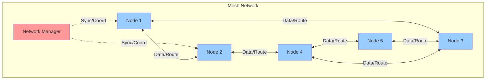
```mermaid
graph TB
    subgraph "Mesh Network"
        NM[Network Manager]
        N1[Node 1]
        N2[Node 2]
        N3[Node 3]
        N4[Node 4]
        N5[Node 5]
    end
    
    NM -.->|Sync/Coord| N1
    NM -.->|Sync/Coord| N2
    N1 <-->|Data/Route| N2
    N1 <-->|Data/Route| N3
    N2 <-->|Data/Route| N4
    N3 <-->|Data/Route| N4
    N4 <-->|Data/Route| N5
    N5 <-->|Data/Route| N3
    
    style NM fill:#ff9999
    style N1 fill:#99ccff
    style N2 fill:#99ccff
    style N3 fill:#99ccff
    style N4 fill:#99ccff
    style N5 fill:#99ccff
```

### 1.3 Protocol Stack

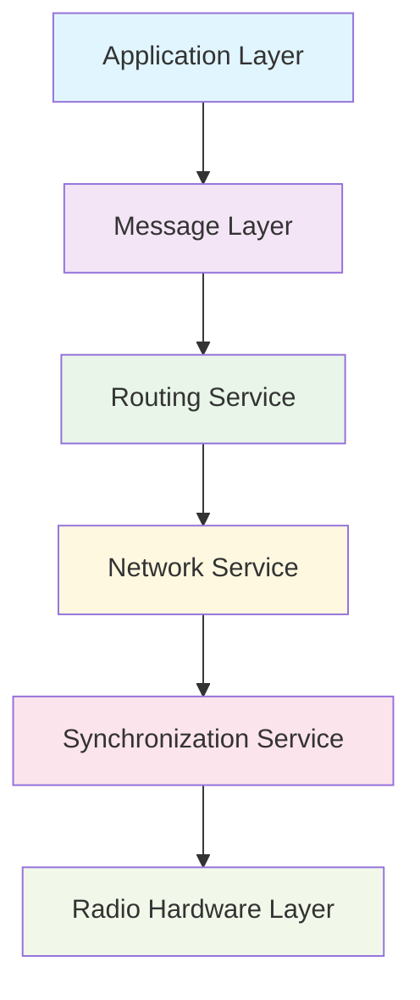
```mermaid
graph TB
    App[Application Layer]
    Msg[Message Layer]
    Route[Routing Service]
    Net[Network Service]
    Sync[Synchronization Service]
    Radio[Radio Hardware Layer]
    
    App --> Msg
    Msg --> Route
    Route --> Net
    Net --> Sync
    Sync --> Radio
    
    style App fill:#e1f5fe
    style Msg fill:#f3e5f5
    style Route fill:#e8f5e8
    style Net fill:#fff8e1
    style Sync fill:#fce4ec
    style Radio fill:#f1f8e9
```

---

## 2. State Machine Specification

### 2.1 Protocol States

The LoRaMesher protocol operates in six distinct states:

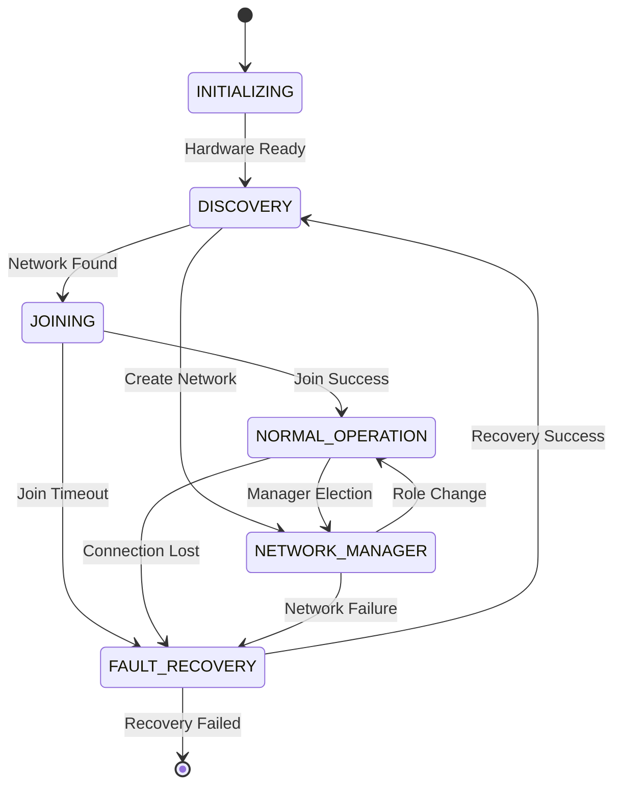
```mermaid
stateDiagram-v2
    [*] --> INITIALIZING
    INITIALIZING --> DISCOVERY : Hardware Ready
    DISCOVERY --> JOINING : Network Found
    DISCOVERY --> NETWORK_MANAGER : Create Network
    JOINING --> NORMAL_OPERATION : Join Success
    JOINING --> FAULT_RECOVERY : Join Timeout
    NORMAL_OPERATION --> NETWORK_MANAGER : Manager Election
    NORMAL_OPERATION --> FAULT_RECOVERY : Connection Lost
    NETWORK_MANAGER --> NORMAL_OPERATION : Role Change
    NETWORK_MANAGER --> FAULT_RECOVERY : Network Failure
    FAULT_RECOVERY --> DISCOVERY : Recovery Success
    FAULT_RECOVERY --> [*] : Recovery Failed
```

### 2.2 State Descriptions

#### INITIALIZING
- **Purpose**: System startup and hardware configuration
- **Duration**: 1-5 seconds
- **Activities**: 
  - Initialize radio hardware
  - Load configuration parameters
  - Start protocol services
- **Transitions**: 
  - Success → `DISCOVERY`
  - Failure → Protocol termination

#### DISCOVERY
- **Purpose**: Find existing networks or create new one
- **Duration**: 10-30 seconds (configurable)
- **Activities**:
  - Listen for network beacons
  - Broadcast discovery messages
  - Evaluate network options
- **Transitions**:
  - Network found → `JOINING`
  - Timeout with no networks → `NETWORK_MANAGER`
  - Critical error → `FAULT_RECOVERY`

#### JOINING
- **Purpose**: Connect to discovered network
- **Duration**: 5-15 seconds
- **Activities**:
  - Send join request to network manager
  - Negotiate slot assignment
  - Synchronize with network timing
- **Transitions**:
  - Join successful → `NORMAL_OPERATION`
  - Join failed/timeout → `FAULT_RECOVERY`

#### NORMAL_OPERATION
- **Purpose**: Standard data communication and routing
- **Duration**: Indefinite
- **Activities**:
  - Process and forward data messages
  - Maintain routing tables
  - Participate in network synchronization
- **Transitions**:
  - Elected as manager → `NETWORK_MANAGER`
  - Connection loss → `FAULT_RECOVERY`

#### NETWORK_MANAGER
- **Purpose**: Coordinate network timing and topology
- **Duration**: Indefinite
- **Activities**:
  - Broadcast synchronization beacons
  - Manage slot allocations
  - Handle join requests
  - Coordinate routing updates
- **Transitions**:
  - Role transferred → `NORMAL_OPERATION`
  - Network failure → `FAULT_RECOVERY`

#### FAULT_RECOVERY
- **Purpose**: Handle connection loss and network failures
- **Duration**: 30-60 seconds
- **Activities**:
  - Attempt to reconnect to known networks
  - Clear stale routing information
  - Reset synchronization state
- **Transitions**:
  - Recovery successful → `DISCOVERY`
  - Recovery failed → Protocol termination

### 2.3 State Transition Triggers

| From State | To State | Trigger | Condition |
|------------|----------|---------|-----------|
| INITIALIZING | DISCOVERY | Hardware Ready | Radio initialized successfully |
| DISCOVERY | JOINING | Network Found | Valid beacon received |
| DISCOVERY | NETWORK_MANAGER | Timeout | No networks found after timeout |
| JOINING | NORMAL_OPERATION | Join Success | JOIN_RESPONSE received |
| JOINING | FAULT_RECOVERY | Join Timeout | No response to JOIN_REQUEST |
| NORMAL_OPERATION | NETWORK_MANAGER | Manager Election | Current manager lost |
| NORMAL_OPERATION | FAULT_RECOVERY | Connection Lost | No valid messages for timeout period |
| NETWORK_MANAGER | NORMAL_OPERATION | Role Change | Another node elected manager |
| FAULT_RECOVERY | DISCOVERY | Recovery Success | Ready to rejoin network |

---

## 3. Message Format Specification

### 3.1 Message Type Organization

Messages are organized in a hierarchical 16×16 structure:

```cpp
// Message categories (upper 4 bits)
DATA_MESSAGE    = 0x10,  // Application data transmission
CONTROL_MESSAGE = 0x20,  // Protocol control and management
ROUTING_MESSAGE = 0x30,  // Routing table updates
SYSTEM_MESSAGE  = 0x40,  // System management and diagnostics
```

### 3.2 Message Type Organization System (v1.2)

LoRaMesher v1.2 uses a sophisticated bit-field organization for message types that enables systematic categorization and efficient parsing:

#### 3.2.1 Bit-Field Structure

```cpp
/**
 * Message Type Organization (8-bit field):
 * - Bits 7-4 (high nibble): Main message category
 * - Bits 3-0 (low nibble): Subtype within the category
 *
 * This allows for 16 main categories with 16 subtypes each = 256 possible message types
 */
enum class MessageType : uint8_t {
    // Main categories (high nibble)
    DATA_MSG = 0x10,     // 0001 xxxx: Data message category
    CONTROL_MSG = 0x20,  // 0010 xxxx: Control message category
    ROUTING_MSG = 0x30,  // 0011 xxxx: Routing message category
    SYSTEM_MSG = 0x40,   // 0100 xxxx: System message category

    // Complete message types with categories + subtypes
    // Data messages (0x1x)
    DATA = 0x11,         // 0001 0001: Regular data message

    // Control messages (0x2x)
    ACK = 0x21,          // 0010 0001: Acknowledgment
    PING = 0x23,         // 0010 0011: Ping request
    PONG = 0x24,         // 0010 0100: Pong response

    // Routing messages (0x3x)
    HELLO = 0x31,        // 0011 0001: Hello packet for routing
    ROUTE_TABLE = 0x32,  // 0011 0010: Routing table update

    // System messages (0x4x)
    SYNC = 0x41,         // 0100 0001: Synchronization packet
    JOIN_REQUEST = 0x42, // 0100 0010: Request to join network
    JOIN_RESPONSE = 0x43,// 0100 0011: Response to join request
    SYNC_BEACON = 0x46,  // 0100 0110: Multi-hop sync beacon
};
```

#### 3.2.2 Category Benefits

**Efficient Parsing**: Nodes can quickly determine message category using bit masking:
```cpp
MessageType main_type = static_cast<MessageType>(message_type & 0xF0);
if (main_type == MessageType::SYSTEM_MSG) {
    // Handle system message
}
```

**Systematic Extension**: New message types can be added systematically within existing categories or by creating new categories.

**Protocol Evolution**: The 4+4 bit structure provides room for 240+ additional message types while maintaining backward compatibility.

### 3.3 Core Message Types

#### 3.3.1 Join Messages (Updated v1.2)
```cpp
// Join process messages with sponsor support
JOIN_REQUEST  = 0x42,  // Request to join network (with sponsor support)
JOIN_RESPONSE = 0x43,  // Response to join request (with routing semantics)
```

**JOIN_REQUEST Format (Updated v1.2)**:
```cpp
struct JoinRequestHeader {
    // Standard message header (6 bytes)
    AddressType destination;        // Network Manager or next hop (2 bytes)
    AddressType source;             // Requesting node address (2 bytes)
    MessageType type = JOIN_REQUEST; // Message type 0x42 (1 byte)
    uint8_t payload_size;           // Size of join request payload (1 byte)

    // Join request specific fields (9 bytes)
    uint8_t capabilities;           // Node capability flags (1 byte)
    uint8_t battery_level;          // Battery level 0-100% (1 byte)
    uint8_t requested_slots;        // Number of data slots requested (1 byte)
    AddressType next_hop;           // Next hop for message forwarding (2 bytes)
    AddressType sponsor_address;    // Sponsor node address (0 = no sponsor) (2 bytes)
};
```

**JOIN_RESPONSE Format (Updated v1.2)**:
```cpp
struct JoinResponseHeader {
    // Standard message header (6 bytes)
    AddressType destination;         // Sponsor address (immediate routing) (2 bytes)
    AddressType source;              // Network Manager address (2 bytes)
    MessageType type = JOIN_RESPONSE; // Message type 0x43 (1 byte)
    uint8_t payload_size;            // Size of response payload (1 byte)

    // Join response specific fields (11 bytes)
    uint16_t network_id;             // Network identifier (2 bytes)
    uint8_t allocated_slots;         // Number of allocated data slots (1 byte)
    ResponseStatus status;           // Response status code (1 byte)
    AddressType next_hop;            // Next hop for message forwarding (2 bytes)
    AddressType target_address;      // Final recipient (joining node) (2 bytes)

    // Optional superframe info in payload
};
```

**JOIN_RESPONSE Status Codes**:
- `ACCEPTED = 0x00`: Join request accepted, slot allocated
- `REJECTED = 0x01`: Join request rejected due to constraints
- `CAPACITY_EXCEEDED = 0x02`: Network at capacity
- `AUTHENTICATION_FAILED = 0x03`: Authentication failed
- `RETRY_LATER = 0x04`: Temporarily rejected, retry after delay

**Key v1.2 Routing Semantics**:
- **destination**: Immediate next hop for message routing
- **target_address**: Final recipient for end-to-end delivery
- **sponsor_address**: Intermediate node facilitating join for nodes beyond Network Manager range

**Sponsor-Based Join Flow**:
1. Joining node selects sponsor (first sync beacon sender)
2. JOIN_REQUEST routed via sponsor to Network Manager
3. Network Manager sends JOIN_RESPONSE to sponsor with target_address=joining_node
4. Sponsor forwards response to final target (joining node)

#### 3.3.2 Routing Messages
```cpp
// Routing protocol messages (v1.2)
HELLO = 0x31,        // Hello packet for neighbor discovery
ROUTE_TABLE = 0x32,  // Routing table exchange (documented in 3.2.3)
```

**HELLO Format**:
```cpp
struct HelloMessage {
    // Standard message header (6 bytes)
    AddressType destination;     // Broadcast or target (2 bytes)
    AddressType source;          // Sending node address (2 bytes)
    MessageType type = HELLO;    // Message type 0x31 (1 byte)
    uint8_t payload_size;        // Size of hello payload (1 byte)

    // Hello-specific fields
    uint32_t timestamp;          // Transmission timestamp (4 bytes)
    uint8_t sequence_number;     // Message sequence for tracking (1 byte)
    uint8_t link_quality;        // Local link quality assessment (1 byte)
};
```

**Usage**:
- **HELLO messages**: Used for neighbor discovery and link quality assessment
- **ROUTE_TABLE messages**: Used for distance-vector routing table exchange (see section 3.2.3)

#### 3.3.3 Routing Table Messages (New v1.2)
```cpp
// Routing table exchange messages
ROUTE_TABLE = 0x32,  // Distance-vector routing table exchange
```

**ROUTING_TABLE Format (New v1.2)**:
```cpp
struct RoutingTableHeader {
    // Standard message header (6 bytes)
    AddressType destination;         // Target for routing table (2 bytes)
    AddressType source;              // Node sending table (2 bytes)
    MessageType type = ROUTE_TABLE; // Message type 0x32 (1 byte)
    uint8_t payload_size;            // Size of routing entries payload (1 byte)

    // Routing table specific fields (5 bytes)
    AddressType network_manager;     // Network Manager address (2 bytes)
    uint8_t table_version;           // Version for change detection (1 byte)
    uint8_t entry_count;             // Number of entries in message (1 byte)
};

struct RoutingTableEntry {
    AddressType destination;         // Route destination (2 bytes)
    uint8_t hop_count;               // Hops to destination (1 byte)
    uint8_t link_quality;            // Link quality metric 0-255 (1 byte)
    uint8_t allocated_data_slots;    // Data slots for this node (1 byte)
};
```

**Routing Table Message Benefits**:
- **Versioned Updates**: Table version enables efficient change detection
- **Modular Architecture**: Clean separation from legacy ROUTING_UPDATE format
- **Link Quality Support**: Built-in infrastructure for advanced routing algorithms
- **Compact Format**: 5 bytes per route entry for efficient transmission

**Usage in Distance-Vector Protocol**:
1. Each node broadcasts routing table during CONTROL_TX slots
2. Version increments enable delta updates and loop detection
3. Link quality metrics prepare for future advanced routing algorithms
4. Entry count allows variable-length route advertisements

#### 3.3.4 Synchronization Messages
```cpp
// Network synchronization messages
SYNC_BEACON = 0x46,  // Multi-hop synchronization beacon
```

**SYNC_BEACON Format (Optimized)**:

*Message Size*: 19 bytes total (6-byte base header + 13-byte sync fields)
- **Optimization**: Reduced from 31 bytes (39% size reduction)  
- **Power Impact**: Lower transmission time and energy consumption

```cpp
struct SyncBeaconHeader {
    // Standard message header (6 bytes)
    AddressType destination = 0xFFFF;    // Broadcast to all nodes (2 bytes)
    AddressType source;                  // Current transmitter address (2 bytes)
    MessageType type = SYNC_BEACON;      // Message type 0x46 (1 byte)
    uint8_t payload_size = 0;            // No payload data (1 byte)
    
    // Core synchronization fields (7 bytes)
    uint16_t network_id;                 // Network identifier (2 bytes)
    uint8_t total_slots;                 // Slots in complete superframe (1 byte)
    uint16_t slot_duration_ms;           // Individual slot duration (2 bytes) [OPTIMIZED: was 4 bytes]
    AddressType network_manager;         // Network Manager address (2 bytes)

    // Multi-hop forwarding fields (6 bytes)
    uint8_t hop_count;                   // Hops from Network Manager (1 byte)
    uint32_t propagation_delay_ms;       // Accumulated forwarding delay (4 bytes)
    uint8_t max_hops;                    // Network diameter limit (1 byte)
};

// Calculated fields (not transmitted):
// - superframe_duration_ms = total_slots * slot_duration_ms
```

#### 3.3.5 Data Messages
```cpp
// Application data messages
DATA_UNICAST   = 0x11,  // Point-to-point data
DATA_BROADCAST = 0x12,  // Network-wide broadcast
DATA_MULTICAST = 0x13,  // Group communication
```

**DATA_UNICAST Format**:
```cpp
struct DataUnicast {
    uint8_t messageType;     // 0x11
    uint16_t sourceNode;     // Originating node
    uint16_t destinationNode;// Target node
    uint8_t ttl;            // Time-to-live (hop limit)
    uint16_t sequenceNumber; // Message sequence number
    uint8_t payloadLength;   // Length of application data
    uint8_t payload[MAX_PAYLOAD_SIZE]; // Application data
    uint8_t checksum;        // Message integrity check
};
```

### 3.4 Message Serialization

All messages use little-endian byte order and are serialized using the following process:

1. **Header Creation**: Message type and routing information
2. **Payload Serialization**: Application data with length prefix
3. **Checksum Calculation**: Simple XOR checksum of all bytes
4. **Size Validation**: Ensure total size ≤ 255 bytes (LoRa constraint)

---

## 4. Routing Algorithm

### 4.0 Routing Update Propagation Sequence

The following diagram shows how routing updates propagate through the network:

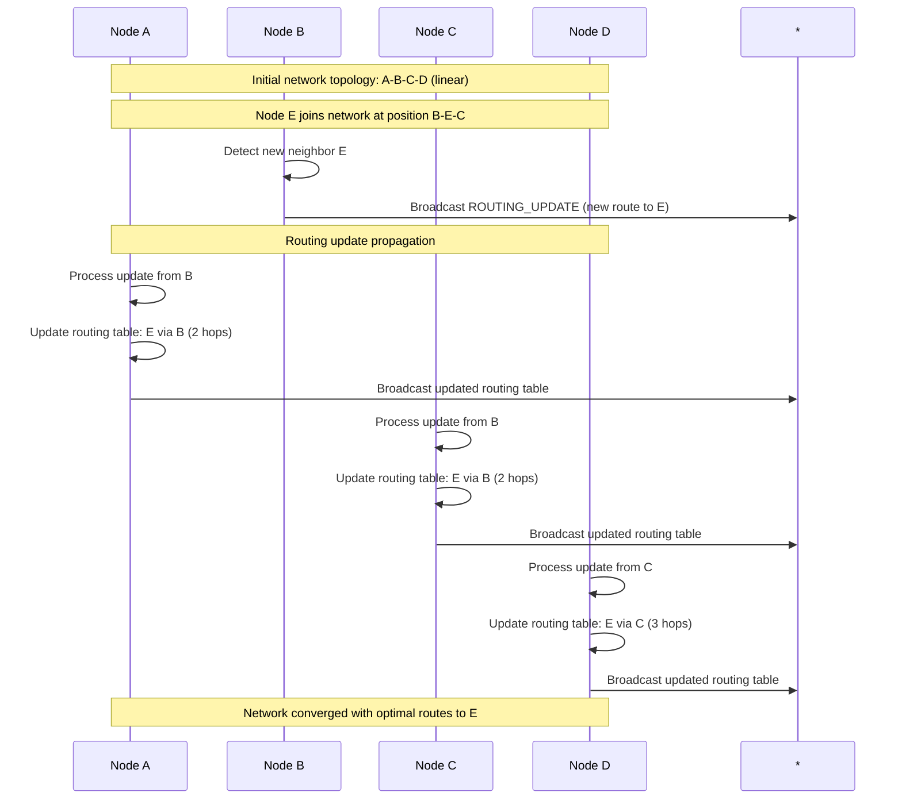
```mermaid
sequenceDiagram
    participant A as Node A
    participant B as Node B  
    participant C as Node C
    participant D as Node D
    
    Note over A,D: Initial network topology: A-B-C-D (linear)
    Note over A,D: Node E joins network at position B-E-C
    
    B->>B: Detect new neighbor E
    B->>*: Broadcast ROUTING_UPDATE (new route to E)
    
    Note over A,D: Routing update propagation
    A->>A: Process update from B
    A->>A: Update routing table: E via B (2 hops)
    A->>*: Broadcast updated routing table
    
    C->>C: Process update from B
    C->>C: Update routing table: E via B (2 hops)
    C->>*: Broadcast updated routing table
    
    D->>D: Process update from C
    D->>D: Update routing table: E via C (3 hops)
    D->>*: Broadcast updated routing table
    
    Note over A,D: Network converged with optimal routes to E
```

### 4.1 Data Message Multi-Hop Forwarding

This diagram illustrates how data messages are forwarded through multiple hops:

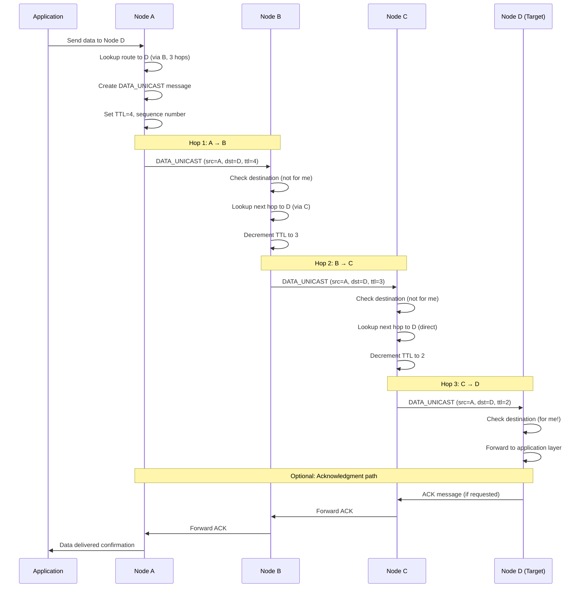
```mermaid
sequenceDiagram
    participant App as Application
    participant A as Node A
    participant B as Node B
    participant C as Node C
    participant D as Node D (Target)
    
    App->>A: Send data to Node D
    A->>A: Lookup route to D (via B, 3 hops)
    A->>A: Create DATA_UNICAST message
    A->>A: Set TTL=4, sequence number
    
    Note over A,B: Hop 1: A → B
    A->>B: DATA_UNICAST (src=A, dst=D, ttl=4)
    B->>B: Check destination (not for me)
    B->>B: Lookup next hop to D (via C)
    B->>B: Decrement TTL to 3
    
    Note over B,C: Hop 2: B → C  
    B->>C: DATA_UNICAST (src=A, dst=D, ttl=3)
    C->>C: Check destination (not for me)
    C->>C: Lookup next hop to D (direct)
    C->>C: Decrement TTL to 2
    
    Note over C,D: Hop 3: C → D
    C->>D: DATA_UNICAST (src=A, dst=D, ttl=2)
    D->>D: Check destination (for me!)
    D->>D: Forward to application layer
    
    Note over A,D: Optional: Acknowledgment path
    D->>C: ACK message (if requested)
    C->>B: Forward ACK
    B->>A: Forward ACK
    A->>App: Data delivered confirmation
```

---

## 4. Routing Algorithm

### 4.1 Distance-Vector Algorithm

LoRaMesher implements a modified Bellman-Ford distance-vector routing algorithm optimized for wireless mesh networks.

#### 4.1.1 Routing Table Structure

```cpp
struct RouteEntry {
    uint16_t destination;    // Destination node ID
    uint16_t nextHop;       // Next hop to reach destination
    uint8_t hops;           // Hop count (primary metric)
    uint8_t linkQuality;    // Link quality (secondary metric)
    uint32_t lastUpdate;    // Timestamp of last update
    uint8_t flags;          // Route flags (valid, temporary, etc.)
};
```

#### 4.1.2 Route Calculation

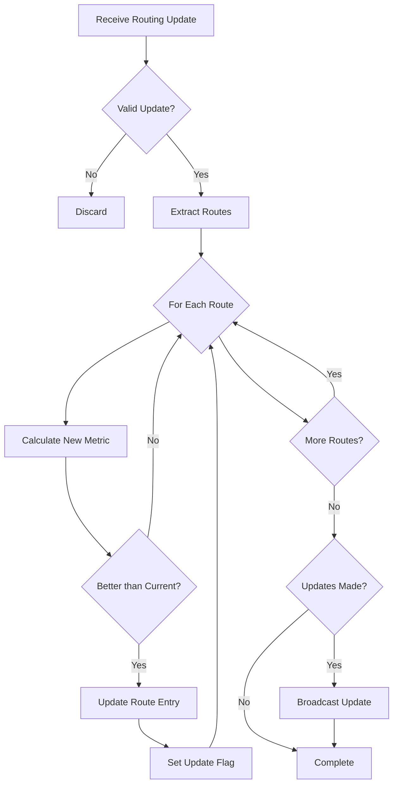
```mermaid
flowchart TB
    A[Receive Routing Update] --> B{Valid Update?}
    B -->|No| C[Discard]
    B -->|Yes| D[Extract Routes]
    D --> E{For Each Route}
    E --> F[Calculate New Metric]
    F --> G{Better than Current?}
    G -->|No| E
    G -->|Yes| H[Update Route Entry]
    H --> I[Set Update Flag]
    I --> E
    E --> J{More Routes?}
    J -->|Yes| E
    J -->|No| K{Updates Made?}
    K -->|Yes| L[Broadcast Update]
    K -->|No| M[Complete]
    L --> M
```

#### 4.1.3 Metric Calculation

**Primary Metric - Hop Count**:
```cpp
uint8_t newHops = receivedHops + 1;
if (newHops > MAX_HOPS) {
    // Route invalid due to hop limit
    return INVALID_ROUTE;
}
```

**Secondary Metric - Link Quality**:
```cpp
uint8_t combinedQuality = (receivedLinkQuality + localLinkQuality) / 2;
if (combinedQuality < MIN_QUALITY_THRESHOLD) {
    // Route below quality threshold
    return POOR_QUALITY_ROUTE;
}
```

**Route Comparison**:
```cpp
bool isBetterRoute(const RouteEntry& current, const RouteEntry& candidate) {
    // Primary comparison: hop count
    if (candidate.hops < current.hops) return true;
    if (candidate.hops > current.hops) return false;
    
    // Secondary comparison: link quality
    return candidate.linkQuality > current.linkQuality;
}
```

### 4.2 Loop Prevention

**Split Horizon**: Don't advertise routes back to the node that provided them
```cpp
void SendRoutingUpdate(uint16_t targetNode) {
    for (auto& route : routingTable) {
        if (route.nextHop != targetNode) {
            // Only advertise if not learned from target
            includeInUpdate(route);
        }
    }
}
```

**Route Poisoning**: Advertise unreachable routes with infinite metric
```cpp
void PoisonRoute(uint16_t destination) {
    RouteEntry poisonRoute;
    poisonRoute.destination = destination;
    poisonRoute.hops = INFINITE_HOPS;
    poisonRoute.linkQuality = 0;
    broadcastRoutingUpdate(poisonRoute);
}
```

### 4.3 Route Aging

Routes are aged out if not refreshed within the configured timeout:

```cpp
void AgeRoutes() {
    uint32_t currentTime = getCurrentTime();
    for (auto& route : routingTable) {
        if (currentTime - route.lastUpdate > ROUTE_TIMEOUT) {
            if (route.flags & ROUTE_PERMANENT) {
                continue; // Don't age permanent routes
            }
            removeRoute(route.destination);
            broadcastRoutePoison(route.destination);
        }
    }
}
```

### 4.5 Network Topology Examples and Routing Behavior

This section demonstrates how the routing algorithm performs in different network topologies.

#### 4.5.1 Linear Network Topology

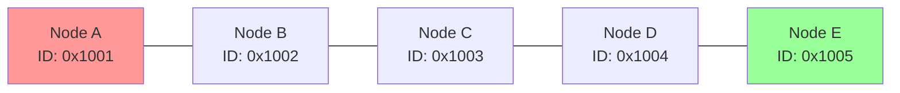
```mermaid
graph LR
    A[Node A<br/>ID: 0x1001] --- B[Node B<br/>ID: 0x1002]
    B --- C[Node C<br/>ID: 0x1003]
    C --- D[Node D<br/>ID: 0x1004]
    D --- E[Node E<br/>ID: 0x1005]
    
    style A fill:#ff9999
    style E fill:#99ff99
```

**Routing Table at Node A:**
| Destination | Next Hop | Hops | Link Quality |
|-------------|----------|------|--------------|
| 0x1002      | 0x1002   | 1    | 220          |
| 0x1003      | 0x1002   | 2    | 180          |
| 0x1004      | 0x1002   | 3    | 150          |
| 0x1005      | 0x1002   | 4    | 120          |

**Data Flow A → E:** A → B → C → D → E (4 hops)

#### 4.5.2 Mesh Network Topology

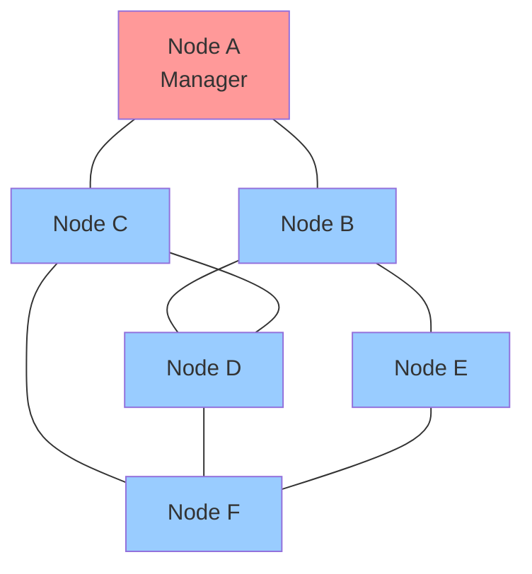
```mermaid
graph TB
    A[Node A<br/>Manager] --- B[Node B]
    A --- C[Node C]
    B --- D[Node D]
    C --- D
    B --- E[Node E]
    C --- F[Node F]
    D --- F
    E --- F
    
    style A fill:#ff9999
    style B fill:#99ccff
    style C fill:#99ccff
    style D fill:#99ccff
    style E fill:#99ccff
    style F fill:#99ccff
```

**Routing Table at Node A (Multiple Path Options):**
| Destination | Primary Route | Backup Route | Hops | Quality |
|-------------|---------------|--------------|------|---------|
| 0x1002      | Direct        | via C        | 1    | 240     |
| 0x1003      | Direct        | via B        | 1    | 230     |
| 0x1004      | via B         | via C        | 2    | 200     |
| 0x1005      | via B         | via C→D      | 2    | 190     |
| 0x1006      | via C         | via B→D      | 2    | 200     |

**Optimal Data Paths from A:**
- A → D: A → B → D (2 hops) or A → C → D (2 hops)
- A → E: A → B → E (2 hops, preferred due to higher link quality)
- A → F: A → C → F (2 hops, preferred due to higher link quality)

#### 4.5.3 Star Network Topology

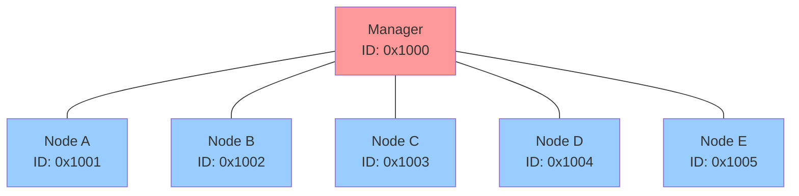
```mermaid
graph TB
    M[Manager<br/>ID: 0x1000] --- A[Node A<br/>ID: 0x1001]
    M --- B[Node B<br/>ID: 0x1002]
    M --- C[Node C<br/>ID: 0x1003]
    M --- D[Node D<br/>ID: 0x1004]
    M --- E[Node E<br/>ID: 0x1005]
    
    style M fill:#ff9999
    style A fill:#99ccff
    style B fill:#99ccff
    style C fill:#99ccff
    style D fill:#99ccff
    style E fill:#99ccff
```

**Routing Table at Node A:**
| Destination | Next Hop | Hops | Link Quality |
|-------------|----------|------|--------------|
| 0x1000      | 0x1000   | 1    | 250          |
| 0x1002      | 0x1000   | 2    | 200          |
| 0x1003      | 0x1000   | 2    | 195          |
| 0x1004      | 0x1000   | 2    | 205          |
| 0x1005      | 0x1000   | 2    | 190          |

**Characteristics:**
- Single point of failure (Manager)
- All inter-node communication requires 2 hops
- Optimal for centralized control scenarios
- Manager handles all routing decisions

#### 4.5.4 Partitioned Network Recovery

This example shows how the network handles and recovers from partitions:

**Before Partition:**
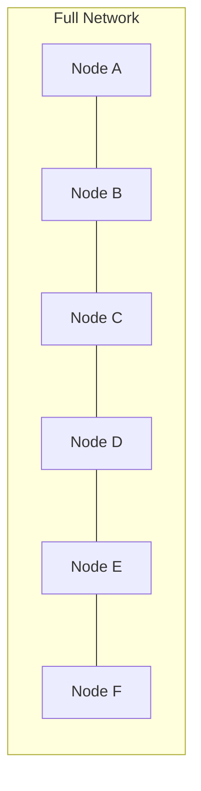
```mermaid
graph LR
    subgraph "Full Network"
        A[Node A] --- B[Node B]
        B --- C[Node C]
        C --- D[Node D]
        D --- E[Node E]
        E --- F[Node F]
    end
```

**During Partition (Link C-D Failed):**
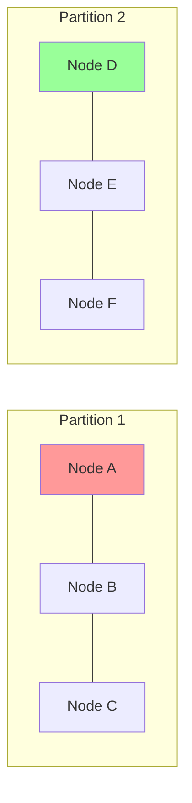
```mermaid
graph LR
    subgraph "Partition 1"
        A[Node A] --- B[Node B]
        B --- C[Node C]
    end
    
    subgraph "Partition 2"  
        D[Node D] --- E[Node E]
        E --- F[Node F]
    end
    
    style A fill:#ff9999
    style D fill:#99ff99
```

**After Healing (Alternative Path A-G-F Discovered):**
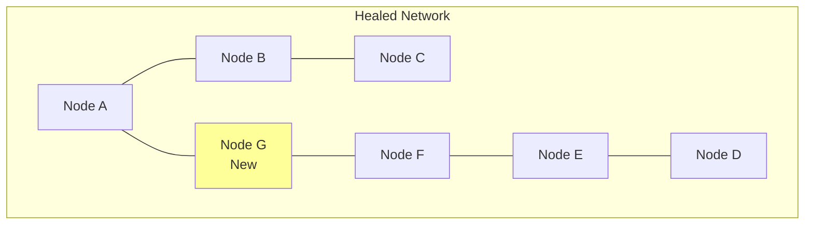
```mermaid
graph TB
    subgraph "Healed Network"
        A[Node A] --- B[Node B]
        B --- C[Node C]
        A --- G[Node G<br/>New]
        G --- F[Node F]
        F --- E[Node E]
        E --- D[Node D]
    end
    
    style G fill:#ffff99
```

**Route Changes During Healing:**
| Phase | A→D Route | Hops | Status |
|-------|-----------|------|--------|
| Normal | A→B→C→D | 3 | Active |
| Partition | No route | ∞ | Failed |
| Healing | A→G→F→E→D | 4 | Restored |

#### 4.5.5 Load Balancing Example

In networks with multiple equal-cost paths, the protocol can distribute traffic:

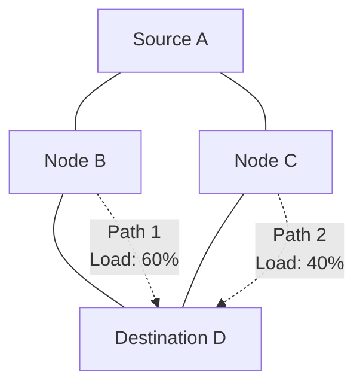
```mermaid
graph TB
    A[Source A] --- B[Node B]
    A --- C[Node C]
    B --- D[Destination D]
    C --- D
    
    B -.->|Path 1<br/>Load: 60%| D
    C -.->|Path 2<br/>Load: 40%| D
```

**Load Distribution Logic:**
```cpp
struct LoadBalancing {
    struct PathMetrics {
        uint8_t hops;
        uint8_t linkQuality;
        uint8_t currentLoad;    // 0-100%
        uint32_t lastUsed;
    };
    
    uint16_t selectNextHop(uint16_t destination) {
        auto equalCostPaths = findEqualCostPaths(destination);
        
        // Weighted selection based on current load
        uint16_t selectedPath = 0;
        uint8_t minLoad = 255;
        
        for (auto& path : equalCostPaths) {
            if (path.currentLoad < minLoad) {
                minLoad = path.currentLoad;
                selectedPath = path.nextHop;
            }
        }
        
        return selectedPath;
    }
};
```

### 4.5 Routing Table Architecture (Updated v1.2)

**Overview**: LoRaMesher v1.2 introduces a modular routing table architecture that separates routing logic from network services and provides infrastructure for advanced routing algorithms.

#### 4.5.1 Routing Table Abstraction

**IRoutingTable Interface**:
The new architecture introduces a clean abstraction layer enabling multiple routing algorithm implementations:

```cpp
class IRoutingTable {
public:
    // Core routing operations
    virtual AddressType FindNextHop(AddressType destination) const = 0;
    virtual bool UpdateRoute(AddressType source, AddressType destination,
                           uint8_t hop_count, uint8_t link_quality,
                           uint8_t allocated_data_slots, uint32_t current_time) = 0;

    // Network node management
    virtual bool AddNode(const NetworkNodeRoute& node) = 0;
    virtual bool UpdateNode(AddressType node_address, uint8_t battery_level,
                          bool is_network_manager, uint8_t allocated_data_slots,
                          uint8_t capabilities, uint32_t current_time) = 0;

    // Route table exchange
    virtual std::vector<RoutingTableEntry> GetRoutingEntries(AddressType exclude_address) const = 0;
    virtual bool ProcessRoutingTableMessage(AddressType source_address,
                                          const std::vector<RoutingTableEntry>& entries,
                                          uint32_t reception_timestamp,
                                          uint8_t local_link_quality,
                                          uint8_t max_hops) = 0;
};
```

#### 4.5.2 Current Implementation: Distance-Vector Routing Table

**Features**:
- **Thread-safe operations**: Mutex protection for concurrent access
- **Route aging and cleanup**: Configurable timeout mechanisms
- **Link quality tracking**: Infrastructure for advanced routing metrics
- **Statistics collection**: Performance monitoring and debugging support
- **Versioned table updates**: Efficient change detection and propagation

**Route Selection Logic** (Current):
```cpp
AddressType FindNextHop(AddressType destination) const {
    std::lock_guard<std::mutex> lock(mutex_);

    AddressType best_next_hop = 0;
    uint8_t best_hop_count = UINT8_MAX;
    uint8_t best_link_quality = 0;

    for (const auto& node : nodes_) {
        if (node.address == destination) {
            // Direct route available
            return destination;
        }

        // Find best intermediate route
        for (const auto& route : node.routes) {
            if (route.destination == destination &&
                route.hop_count < best_hop_count) {
                best_next_hop = node.address;
                best_hop_count = route.hop_count;
                best_link_quality = route.link_quality;
            }
        }
    }

    return best_next_hop;
}
```

#### 4.5.3 Future Advanced Routing Algorithm (Planned v1.3+)

**Enhanced Metrics Framework**:
The current implementation prepares infrastructure for sophisticated routing algorithms:

```cpp
struct AdvancedRoutingMetrics {
    uint8_t hop_count;              // Current: hop count (implemented)
    uint8_t link_quality;           // Current: signal quality (implemented)
    uint8_t delivery_success_rate;  // Future: message delivery statistics
    uint16_t latency_ms;            // Future: round-trip time measurements
    uint8_t load_factor;            // Future: route congestion metrics
    uint32_t last_success_time;     // Future: route freshness tracking
};
```

**Planned Advanced Features**:
1. **Delivery Success Tracking**: Monitor successful message delivery per route
2. **Latency-Aware Routing**: Factor in round-trip times for route selection
3. **Load Balancing**: Distribute traffic across equal-cost paths
4. **Adaptive Route Selection**: Dynamic routing based on network conditions
5. **Congestion Detection**: Identify and avoid overloaded routes

**Route Selection Algorithm (Future)**:
```cpp
AddressType FindNextHop(AddressType destination) const {
    // Multi-metric route evaluation
    float best_score = 0;
    AddressType best_next_hop = 0;

    for (const auto& route : available_routes) {
        float score = CalculateRouteScore(route);
        if (score > best_score) {
            best_score = score;
            best_next_hop = route.next_hop;
        }
    }

    return best_next_hop;
}

float CalculateRouteScore(const Route& route) {
    // Weighted multi-metric scoring
    float hop_score = (256.0 - route.hop_count) / 256.0;
    float quality_score = route.link_quality / 255.0;
    float delivery_score = route.delivery_success_rate / 100.0;
    float latency_score = 1.0 / (1.0 + route.latency_ms / 1000.0);

    return (hop_score * 0.2) + (quality_score * 0.3) +
           (delivery_score * 0.4) + (latency_score * 0.1);
}
```

#### 4.5.4 Architecture Benefits

**Modularity**: Clean separation allows easy algorithm replacement
**Extensibility**: Framework ready for advanced routing metrics
**Performance**: Optimized data structures and thread-safe operations
**Testability**: Interface abstraction enables comprehensive unit testing
**Future-Proofing**: Infrastructure prepared for sophisticated routing enhancements

---

## 5. Network Synchronization (TDMA)

### 5.1 Superframe Structure

The TDMA system organizes time into power-optimized superframes with multi-hop synchronization support:

```
┌─────────────────────────────────────────────────────────────────────────────┐
│                    POWER-OPTIMIZED SUPERFRAME STRUCTURE (Updated v1.2)       │
│                              (Example: 20 slots)                           │
├─────────────────────────────────────────────────────────────────────────────┤
│                                                                             │
│ Slot │ Type           │ Purpose              │ Power State                   │
│ ──────────────────────────────────────────────────────────────────────────  │
│  0   │ SYNC_BEACON_TX │ NM original beacon   │ TX (Network Manager only)     │
│  1   │ SYNC_BEACON_TX │ 1-hop forwarding     │ TX (1-hop nodes only)         │
│  2   │ SYNC_BEACON_TX │ 2-hop forwarding     │ TX (2-hop nodes only)         │
│  3   │ CONTROL_TX     │ NM routing table     │ TX (Network Manager)          │
│  4   │ CONTROL_TX     │ Node A routing       │ TX (Node A), RX (others)      │
│  5   │ CONTROL_TX     │ Node B routing       │ TX (Node B), RX (others)      │
│  6   │ DATA_TX        │ Node A data          │ TX (Node A), RX (neighbors)   │
│  7   │ DATA_TX        │ Node B data          │ TX (Node B), RX (neighbors)   │
│  8-15│ SLEEP          │ Power conservation   │ SLEEP (reduced for optimization) │
│ 16   │ DISCOVERY_RX   │ New node detection   │ RX (all nodes)                │
│ 17   │ DISCOVERY_RX   │ Network monitoring   │ RX (all nodes)                │
│ 18-19│ SLEEP          │ Final power saving   │ SLEEP (end of superframe)     │
│                                                                             │
├─────────────────────────────────────────────────────────────────────────────┤
│ POWER CHARACTERISTICS:                                                      │
│ • Active Slots: 10 (50% - sync: 3, control: 3, data: 2, discovery: 2)     │
│ • Sleep Slots: 10 (50% - optimized for 30% target duty cycle)              │
│ • Actual Duty Cycle: 50% (configurable based on network size)              │
│ • Power Savings: 50% sleep time, adaptive based on traffic                 │
└─────────────────────────────────────────────────────────────────────────────┘
```

### 5.2 Timing Parameters

```cpp
struct SuperframeConfig {
    uint16_t slot_duration_ms;      // Duration of each slot (ms)
    uint8_t total_slots;           // Number of slots in superframe
    uint32_t superframe_duration_ms; // Total superframe duration (ms)
    uint8_t guard_time_ms;         // TX guard time for RX readiness (ms)
    uint32_t sync_tolerance_ms;    // Acceptable sync drift (ms)
    uint8_t max_hops;              // Network diameter limit
    float target_duty_cycle;       // Target power efficiency (0.3 = 30%)
};

// Default configuration (Power-Optimized)
SuperframeConfig defaultConfig = {
    .slot_duration_ms = 1000,      // 1 second per slot
    .total_slots = 20,             // Variable based on network size
    .superframe_duration_ms = 20000, // 20 second superframe
    .guard_time_ms = 50,           // 50ms TX guard time for RX readiness
    .sync_tolerance_ms = 100,      // 100ms sync tolerance
    .max_hops = 5,                 // Maximum network diameter
    .target_duty_cycle = 0.3f      // 30% active, 70% sleep
};
```

### 5.3 Synchronization Protocol

#### 5.3.1 Network Manager Synchronization

The network manager broadcasts optimized synchronization information in slot 0:

```cpp
struct SyncBeaconHeader {
    // Standard message header (6 bytes)
    AddressType destination = 0xFFFF;    // Broadcast to all nodes (2 bytes)
    AddressType source;                  // Current transmitter address (2 bytes)
    MessageType type = SYNC_BEACON;      // Message type 0x46 (1 byte)
    uint8_t payload_size = 0;            // No payload data (1 byte)
    
    // Core synchronization fields (11 bytes)
    uint16_t network_id;                 // Network identifier (2 bytes)
    uint8_t total_slots;                 // Slots in complete superframe (1 byte)
    uint16_t slot_duration_ms;           // Individual slot duration (2 bytes)
    AddressType network_manager;         // Network Manager address (2 bytes)
    
    // Multi-hop forwarding fields (4 bytes)
    uint8_t hop_count;                   // Hops from Network Manager (1 byte)
    uint32_t propagation_delay_ms;       // Accumulated forwarding delay (4 bytes)
    uint8_t max_hops;                    // Network diameter limit (1 byte)
};
// Total: 21 bytes (optimized from 33 bytes - 36% reduction)
```

#### 5.3.1.1 Slot Allocation Updates via Sync Beacon

The sync beacon serves dual purposes: network synchronization and slot allocation coordination. When a new node joins the network, the `total_slots` field communicates the updated superframe structure to all nodes.

**Slot Allocation Update Process**:

1. **Join Request Buffering**: Network Manager buffers join requests until superframe boundary
2. **Superframe Boundary**: At sync beacon transmission, apply pending joins
3. **Updated Sync Beacon**: `total_slots` field reflects new network size
4. **Network-Wide Update**: All nodes recalculate slot allocations based on new `total_slots`

```cpp
void ProcessSyncBeaconForSlotUpdates(const SyncBeaconHeader& beacon) {
    // Check if slot allocation has changed
    if (beacon.total_slots_ != current_total_slots_) {
        LOG_INFO("Slot allocation update detected: %d -> %d slots", 
                 current_total_slots_, beacon.total_slots_);
        
        // Recalculate slot allocations for new network size
        RecalculateSlotAllocation(beacon.total_slots_);
        current_total_slots_ = beacon.total_slots_;
        
        // If joining node, complete join process
        if (current_state_ == JOINING_PENDING) {
            CompleteJoinProcess();
        }
    }
    
    // Continue with normal synchronization processing
    ProcessTimeSynchronization(beacon);
}
```

**Benefits of Sync Beacon Slot Updates**:
- **No Additional Messages**: Leverages existing sync beacon infrastructure
- **Network-Wide Coordination**: All nodes receive updates simultaneously
- **Deterministic Timing**: Updates occur at predictable superframe boundaries
- **Minimal Overhead**: Single byte (`total_slots`) communicates changes

#### 5.3.2 Time Synchronization Algorithm

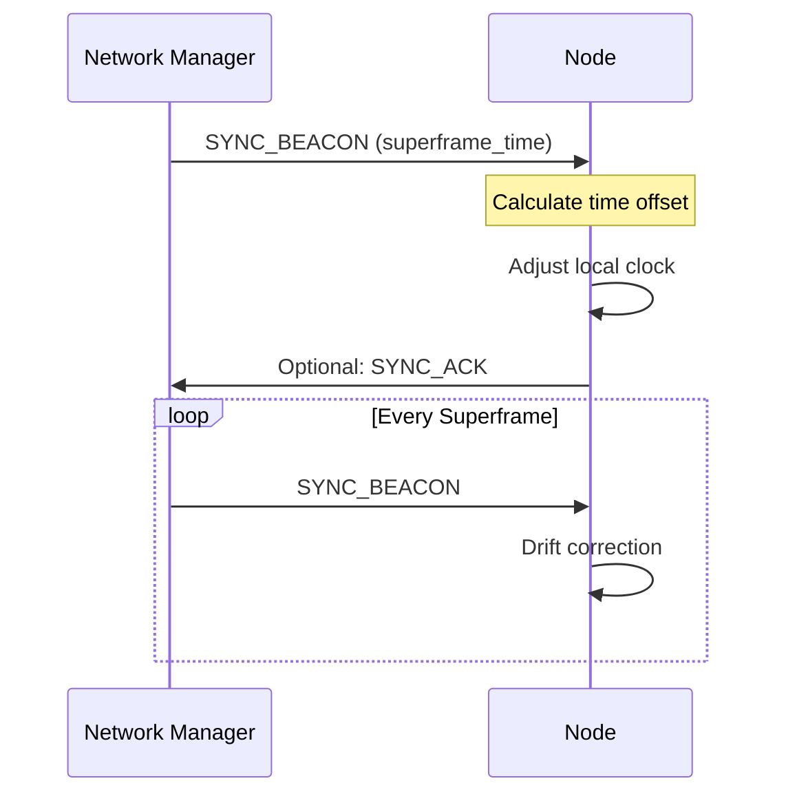
```mermaid
sequenceDiagram
    participant M as Network Manager
    participant N as Node
    
    M->>N: SYNC_BEACON (superframe_time)
    Note over N: Calculate time offset
    N->>N: Adjust local clock
    N->>M: Optional: SYNC_ACK
    
    loop Every Superframe
        M->>N: SYNC_BEACON
        N->>N: Drift correction
    end
```

**Clock Adjustment Logic**:
```cpp
void ProcessSyncBeacon(const SyncMessage& sync) {
    uint32_t receivedTime = getCurrentLocalTime();
    uint32_t expectedTime = sync.superframeTime;
    int32_t drift = receivedTime - expectedTime;
    
    if (abs(drift) > syncTolerance) {
        // Large drift - hard sync
        setLocalTime(expectedTime);
        logEvent("Hard sync: drift = " + std::to_string(drift));
    } else if (abs(drift) > syncTolerance / 2) {
        // Small drift - gradual adjustment
        adjustClockRate(drift);
        logEvent("Soft sync: drift = " + std::to_string(drift));
    }
    
    lastSyncTime = receivedTime;
}
```

### 5.4 Slot Allocation

#### 5.4.1 Initial Allocation

New nodes request slots during the join process:

1. **Slot Request**: Include desired number of slots in JOIN_REQUEST
2. **Slot Assignment**: Network manager assigns available slots
3. **Slot Confirmation**: Node confirms slot usage in first transmission

#### 5.4.2 Dynamic Reallocation

```cpp
struct SlotRequest {
    uint8_t messageType;     // SLOT_REQUEST (0x23)
    uint16_t nodeId;         // Requesting node
    uint8_t requestedSlots;  // Number of slots needed
    uint8_t priority;        // Request priority (0-255)
    uint8_t reason;          // Reason for request
    uint8_t checksum;        // Message integrity
};
```

### 5.5 Multi-Hop Synchronization Strategy

#### 5.5.1 The Multi-Hop Synchronization Challenge

In mesh networks, nodes beyond 1-hop distance from the Network Manager cannot directly receive synchronization beacons. A robust multi-hop forwarding strategy is essential for network-wide time synchronization while avoiding message collisions.

**Problem Statement:**
- **Direct Sync Limitation**: Network Manager broadcasts sync beacon (reaches 1-hop neighbors only)
- **Collision Challenge**: Naive forwarding causes massive collisions when all 1-hop neighbors rebroadcast simultaneously
- **LoRa Collision Risk**: Multiple simultaneous transmitters result in 80-90% collision probability

#### 5.5.2 Hop-Layered Collision-Free Forwarding Solution

**Core Innovation: Sequential Hop Transmission**

The protocol uses hop-layered slot allocation where different hop distances transmit in different time slots:

```
┌─────────────────────────────────────────────────────────────────────────────┐
│                   SYNC BEACON SLOT ALLOCATION BY HOP COUNT                  │
├─────────────────────────────────────────────────────────────────────────────┤
│                                                                             │
│  Slot    Purpose              NM (hop=0)  Node A (hop=1)  Node B (hop=2)   │
│  ────────────────────────────────────────────────────────────────────────   │
│   0   │ Original transmission    TX          RX            RX              │
│   1   │ 1-hop forwarding        SLEEP        TX            RX              │  
│   2   │ 2-hop forwarding        SLEEP       SLEEP          TX              │
│   3   │ 3-hop forwarding        SLEEP       SLEEP         SLEEP            │
│  ...  │ Additional hops          ...         ...           ...             │
│   N   │ Control/Data slots      CTRL         CTRL          CTRL            │
└─────────────────────────────────────────────────────────────────────────────┘
```

**Slot Assignment Algorithm:**
```cpp
// For each sync beacon slot (0 to max_hops-1)
for (hop_layer = 0; hop_layer < max_hops; hop_layer++) {
    if (hop_layer == 0) {
        // Slot 0: Network Manager original transmission  
        if (is_network_manager) {
            slot[0] = SYNC_BEACON_TX;  // NM sends original
        } else {
            slot[0] = SYNC_BEACON_RX;  // Others receive
        }
    } else {
        // Slots 1+: Hop-layered forwarding
        if (my_hop_distance == hop_layer) {
            slot[hop_layer] = SYNC_BEACON_TX;  // Forward from previous hop
        } else if (my_hop_distance == hop_layer + 1) {
            slot[hop_layer] = SYNC_BEACON_RX;  // Receive for next hop
        } else {
            slot[hop_layer] = SLEEP;  // Sleep if not relevant
        }
    }
}
```

**Benefits:**
- **Zero inter-hop collisions**: Different hops transmit in different slots
- **Controlled same-hop collisions**: LoRa's capture effect handles simultaneous same-hop forwards
- **Predictable timing**: Each hop knows when to forward based on distance from Network Manager

### 5.6 Control Slot Allocation Strategy

#### 5.6.1 Deterministic Address-Based Ordering

Control slots are allocated using a deterministic address-based ordering system to ensure all nodes calculate identical slot allocation schedules, preventing conflicts and ensuring reliable routing table exchange.

**Allocation Algorithm:**
```cpp
// 1. Collect all network nodes
std::vector<NetworkNodeRoute> ordered_nodes;
for (const auto& node : network_nodes_) {
    ordered_nodes.emplace_back(node.node_address, node.is_network_manager, 
                               node.routing_entry);
}

// 2. Sort nodes deterministically by address
std::sort(ordered_nodes.begin(), ordered_nodes.end(), 
    [](const NetworkNodeRoute& a, const NetworkNodeRoute& b) {
        // Network Manager always gets first control slot
        if (a.is_network_manager != b.is_network_manager) {
            return a.is_network_manager > b.is_network_manager;
        }
        // Then sort by address for deterministic ordering
        return a.routing_entry.destination < b.routing_entry.destination;
    });

// 3. Assign TX/RX slots based on order
for (size_t i = 0; i < ordered_nodes.size(); ++i) {
    uint8_t control_slot = sync_beacon_slots + i;
    
    if (ordered_nodes[i].routing_entry.destination == local_node_address) {
        slots[control_slot] = SlotType::CONTROL_TX;  // Send routing table
    } else {
        slots[control_slot] = SlotType::CONTROL_RX;  // Receive routing table
    }
}
```

**Key Benefits:**
- **Deterministic**: All nodes calculate identical slot allocation using same address ordering
- **Conflict-Free**: Each node gets exactly one CONTROL_TX slot per superframe
- **Network Manager Priority**: Network Manager always gets first control slot
- **Scalable**: Works reliably across 2-50 node networks
- **Synchronization Independent**: No coordination required between nodes

### 5.6 TX Guard Time Mechanism

#### 5.6.1 Purpose and Motivation

The TX guard time mechanism addresses the fundamental challenge of RX readiness in TDMA-based mesh networks. When a node begins transmitting at the precise start of its allocated slot, other nodes may not have sufficient time to transition from sleep/idle state to active reception, resulting in lost synchronization and data packets.

**Problem Statement:**
- **RX Setup Time**: Nodes require finite time to transition from sleep to active reception
- **Clock Drift**: Small timing differences between nodes can cause missed receptions
- **Synchronization Preservation**: Lost sync beacons can cause network fragmentation
- **LoRa Radio Constraints**: SX126x/SX127x radios need setup time for frequency, spreading factor, and RX configuration

#### 5.6.2 Guard Time Implementation

**Core Concept**: TX nodes delay their transmission by a configurable guard time to ensure RX nodes are ready to receive.

```cpp
// Guard time configuration
struct GuardTimeConfig {
    uint32_t guard_time_ms;        // TX delay for RX readiness (default: 50ms)
    uint32_t transmission_delay_ms; // Calculated via get_time_on_air()
    uint32_t sync_compensation_ms;  // Timing compensation for sync beacons
};

// Implementation in slot processing
void ProcessSlotMessages(uint16_t current_slot, SlotAllocation::SlotType slot_type) {
    switch (slot_type) {
        case SlotAllocation::SlotType::SYNC_BEACON_TX:
        case SlotAllocation::SlotType::CONTROL_TX:
        case SlotAllocation::SlotType::DATA_TX:
            // Apply guard time delay before transmission
            uint32_t guard_delay = config_.guard_time_ms;
            
            // Sleep for guard time to allow RX nodes to prepare
            GetRTOS().DelayTask(guard_delay);
            
            // Proceed with transmission
            TransmitSlotMessage(current_slot, slot_type);
            break;
            
        case SlotAllocation::SlotType::SYNC_BEACON_RX:
        case SlotAllocation::SlotType::CONTROL_RX:
        case SlotAllocation::SlotType::DATA_RX:
            // RX nodes start listening immediately (no guard time)
            ReceiveSlotMessage(current_slot, slot_type);
            break;
    }
}
```

#### 5.6.3 Timing Compensation for Synchronization

**Challenge**: Guard time delays can cause timing drift in sync beacon reception, leading to network desynchronization.

**Solution**: Compensate for guard time and transmission delays when processing sync beacons.

```cpp
void ProcessSyncBeacon(const SyncBeaconHeader& sync_beacon) {
    // Calculate total delay introduced by guard time mechanism
    uint32_t guard_delay = config_.guard_time_ms;
    uint32_t transmission_delay = GetTimeOnAir(sync_beacon);
    uint32_t total_delay = guard_delay + transmission_delay;
    
    // Apply compensation to superframe synchronization
    superframe_service_->SynchronizeWith(total_delay, current_slot);
    
    // Update propagation delay for multi-hop forwarding
    if (sync_beacon.hop_count > 0) {
        uint32_t updated_delay = sync_beacon.propagation_delay_ms + total_delay;
        ForwardSyncBeacon(sync_beacon, updated_delay);
    }
}
```

#### 5.6.4 Multi-Hop Synchronization with Guard Time

**Forward Sync Beacon with Accumulated Timing**:
```cpp
void ForwardSyncBeacon(const SyncBeaconHeader& received_beacon, uint32_t slot_type) {
    // Create forwarded beacon with updated timing
    SyncBeaconHeader forward_beacon = received_beacon;
    forward_beacon.source = node_address_;
    forward_beacon.hop_count = received_beacon.hop_count + 1;
    
    // Accumulate guard time and transmission delays
    uint32_t guard_delay = config_.guard_time_ms;
    uint32_t transmission_delay = GetTimeOnAir(forward_beacon);
    forward_beacon.propagation_delay_ms = 
        received_beacon.propagation_delay_ms + guard_delay + transmission_delay;
    
    // Apply guard time before forwarding
    GetRTOS().DelayTask(guard_delay);
    
    // Forward with accumulated timing compensation
    TransmitMessage(forward_beacon);
}
```

#### 5.6.5 Configuration Guidelines

**Guard Time Selection**:
- **Minimum**: 20ms (basic radio setup time)
- **Recommended**: 50ms (reliable for most network conditions)
- **Maximum**: 100ms (high-latency environments)

**Considerations**:
- **Network Size**: Larger networks may need longer guard times
- **Clock Accuracy**: Poor clock accuracy requires longer guard times
- **Power Constraints**: Longer guard times reduce effective slot utilization
- **Latency Requirements**: Applications requiring low latency should minimize guard time

#### 5.6.6 Benefits and Trade-offs

**Benefits**:
- **Improved Synchronization**: Higher sync beacon reception success rate
- **Reduced Packet Loss**: Better RX readiness reduces data loss
- **Network Stability**: More reliable TDMA coordination
- **Adaptive Timing**: Compensates for hardware and clock variations

**Trade-offs**:
- **Reduced Slot Utilization**: Guard time reduces effective transmission time
- **Increased Latency**: Additional delay in slot processing
- **Power Consumption**: Longer active periods during guard time
- **Complexity**: Additional timing calculations and compensation logic

### 5.7 Power-Aware Slot Allocation

#### 5.7.1 Slot Types and Power States

| Slot Type | Purpose | Power State |
|-----------|---------|-------------|
| TX | Transmit data/control messages | Active (High Power) |
| RX | Receive data/control messages | Active (Medium Power) |
| SYNC_BEACON_TX | Transmit beacon synchronization | Active (High Power) |
| SYNC_BEACON_RX | Receive beacon synchronization | Active (Medium Power) |
| CONTROL_TX | Transmit network management | Active (High Power) |
| CONTROL_RX | Receive network management | Active (Medium Power) |
| DISCOVERY_TX | Transmit network beacons | Active (High Power) |
| DISCOVERY_RX | Listen for network activity | Active (Medium Power) |
| SLEEP | Radio power down | Sleep (Minimal Power) |

#### 5.7.2 Power-Optimized Slot Allocation Formula

For N-node network (1 manager + N-1 regular nodes):

```
Required Active Slots:
- Beacon Slots = max_hops (hop-layered forwarding)
- Control Slots = N (1 TX manager + N-1 RX nodes)
- Data Slots = N × data_slots_per_node
- Discovery Slots = min(5, max(2, ceil(N/3)))
- Total Active = Beacon + Control + Data + Discovery

Power-Optimized Superframe:
- Target Duty Cycle = 30% (configurable)
- Superframe Size = ceil(Total Active / Target Duty Cycle)
- SLEEP Slots = Superframe Size - Total Active
- Actual Duty Cycle = Total Active / Superframe Size
```

### 5.8 Network Manager Election Sequence

When the current network manager fails, a new manager must be elected:

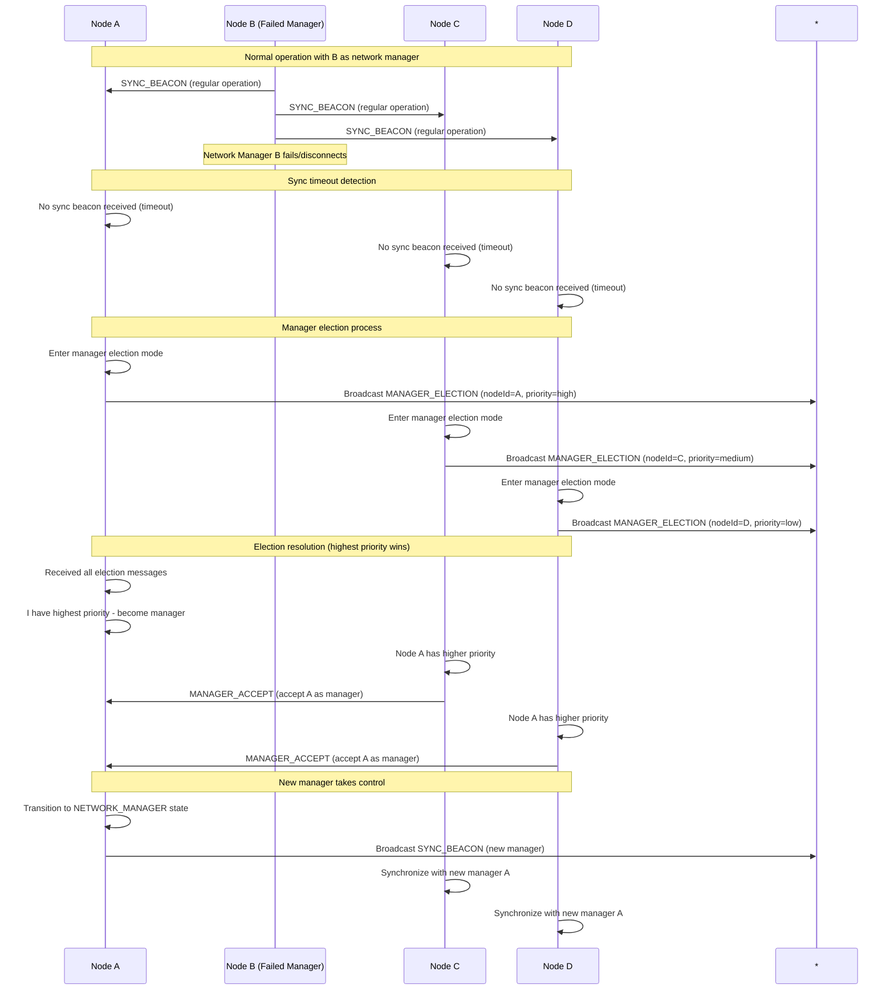
```mermaid
sequenceDiagram
    participant A as Node A
    participant B as Node B (Failed Manager)
    participant C as Node C
    participant D as Node D
    
    Note over A,D: Normal operation with B as network manager
    B->>A: SYNC_BEACON (regular operation)
    B->>C: SYNC_BEACON (regular operation)  
    B->>D: SYNC_BEACON (regular operation)
    
    Note over B: Network Manager B fails/disconnects
    
    Note over A,D: Sync timeout detection
    A->>A: No sync beacon received (timeout)
    C->>C: No sync beacon received (timeout)
    D->>D: No sync beacon received (timeout)
    
    Note over A,D: Manager election process
    A->>A: Enter manager election mode
    A->>*: Broadcast MANAGER_ELECTION (nodeId=A, priority=high)
    
    C->>C: Enter manager election mode
    C->>*: Broadcast MANAGER_ELECTION (nodeId=C, priority=medium)
    
    D->>D: Enter manager election mode
    D->>*: Broadcast MANAGER_ELECTION (nodeId=D, priority=low)
    
    Note over A,D: Election resolution (highest priority wins)
    A->>A: Received all election messages
    A->>A: I have highest priority - become manager
    
    C->>C: Node A has higher priority
    C->>A: MANAGER_ACCEPT (accept A as manager)
    
    D->>D: Node A has higher priority  
    D->>A: MANAGER_ACCEPT (accept A as manager)
    
    Note over A,D: New manager takes control
    A->>A: Transition to NETWORK_MANAGER state
    A->>*: Broadcast SYNC_BEACON (new manager)
    
    C->>C: Synchronize with new manager A
    D->>D: Synchronize with new manager A
```

### 5.6 Fault Recovery and Network Healing

This sequence shows how the network recovers from partitions:

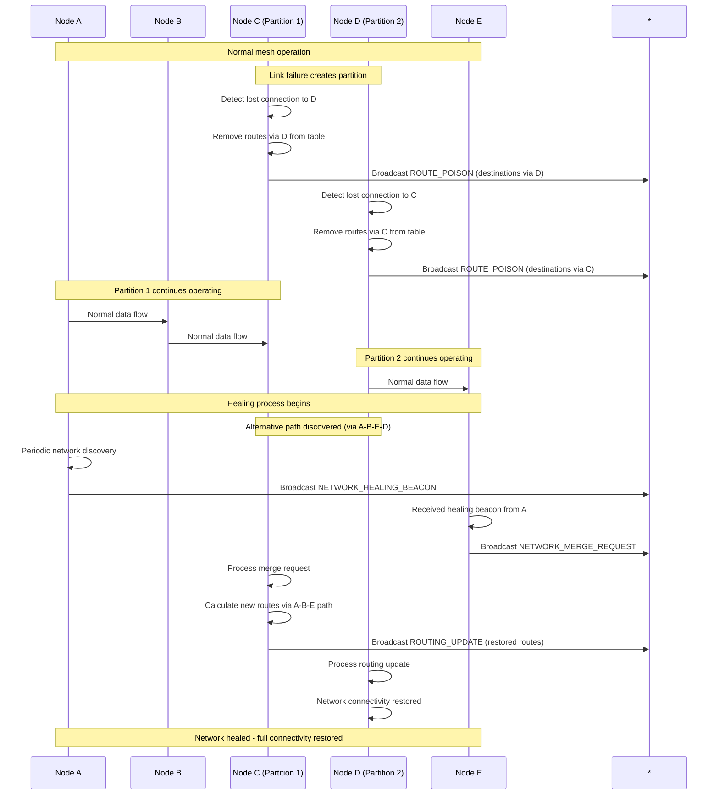
```mermaid
sequenceDiagram
    participant A as Node A
    participant B as Node B  
    participant C as Node C (Partition 1)
    participant D as Node D (Partition 2)
    participant E as Node E
    
    Note over A,E: Normal mesh operation
    Note over C,D: Link failure creates partition
    
    C->>C: Detect lost connection to D
    C->>C: Remove routes via D from table
    C->>*: Broadcast ROUTE_POISON (destinations via D)
    
    D->>D: Detect lost connection to C
    D->>D: Remove routes via C from table  
    D->>*: Broadcast ROUTE_POISON (destinations via C)
    
    Note over A,C: Partition 1 continues operating
    A->>B: Normal data flow
    B->>C: Normal data flow
    
    Note over D,E: Partition 2 continues operating
    D->>E: Normal data flow
    
    Note over A,E: Healing process begins
    Note over C,D: Alternative path discovered (via A-B-E-D)
    
    A->>A: Periodic network discovery
    A->>*: Broadcast NETWORK_HEALING_BEACON
    
    E->>E: Received healing beacon from A
    E->>*: Broadcast NETWORK_MERGE_REQUEST
    
    C->>C: Process merge request
    C->>C: Calculate new routes via A-B-E path
    C->>*: Broadcast ROUTING_UPDATE (restored routes)
    
    D->>D: Process routing update
    D->>D: Network connectivity restored
    
    Note over A,E: Network healed - full connectivity restored
```

---

## 6. Network Discovery & Joining

### 6.1 Network Discovery Process

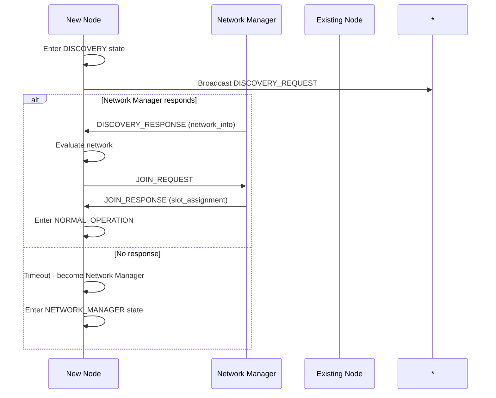
```mermaid
sequenceDiagram
    participant N as New Node
    participant M as Network Manager
    participant E as Existing Node
    
    N->>N: Enter DISCOVERY state
    N->>*: Broadcast DISCOVERY_REQUEST
    
    alt Network Manager responds
        M->>N: DISCOVERY_RESPONSE (network_info)
        N->>N: Evaluate network
        N->>M: JOIN_REQUEST
        M->>N: JOIN_RESPONSE (slot_assignment)
        N->>N: Enter NORMAL_OPERATION
    else No response
        N->>N: Timeout - become Network Manager
        N->>N: Enter NETWORK_MANAGER state
    end
```

### 6.2 Discovery Messages

#### 6.2.1 Discovery Request
```cpp
struct DiscoveryRequest {
    uint8_t messageType;     // DISCOVERY_REQUEST (0x24)
    uint16_t nodeId;         // Discovering node ID
    uint8_t capabilities;    // Node capabilities
    uint8_t preferredRole;   // Preferred network role
    uint8_t maxHops;         // Maximum network diameter
    uint8_t checksum;        // Message integrity
};
```

#### 6.2.2 Discovery Response
```cpp
struct DiscoveryResponse {
    uint8_t messageType;     // DISCOVERY_RESPONSE (0x25)
    uint16_t managerId;      // Network manager ID
    uint16_t networkId;      // Network identifier
    uint8_t networkSize;     // Number of active nodes
    uint8_t availableSlots;  // Number of free slots
    uint8_t networkQuality;  // Overall network quality
    uint32_t uptime;         // Network uptime
    uint8_t checksum;        // Message integrity
};
```

### 6.3 Join Process

#### 6.3.0 Join Request Flow with Superframe Coordination

The following sequence diagram illustrates the coordinated join process:

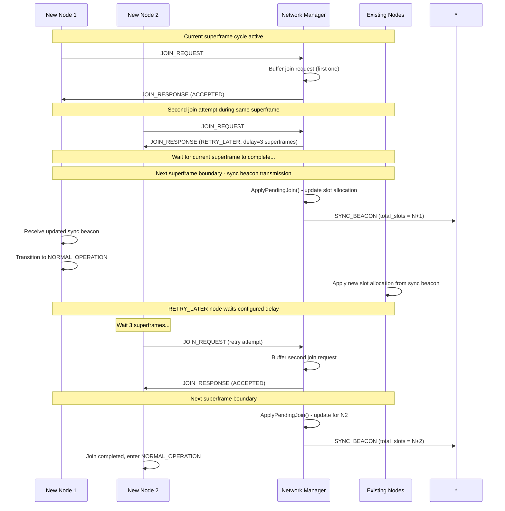
```mermaid
sequenceDiagram
    participant N1 as New Node 1
    participant N2 as New Node 2
    participant M as Network Manager
    participant E as Existing Nodes
    
    Note over N1,E: Current superframe cycle active
    
    N1->>M: JOIN_REQUEST
    M->>M: Buffer join request (first one)
    M->>N1: JOIN_RESPONSE (ACCEPTED)
    
    Note over N1,E: Second join attempt during same superframe
    N2->>M: JOIN_REQUEST  
    M->>N2: JOIN_RESPONSE (RETRY_LATER, delay=3 superframes)
    
    Note over N1,E: Wait for current superframe to complete...
    
    Note over N1,E: Next superframe boundary - sync beacon transmission
    M->>M: ApplyPendingJoin() - update slot allocation
    M->>*: SYNC_BEACON (total_slots = N+1)
    
    N1->>N1: Receive updated sync beacon
    N1->>N1: Transition to NORMAL_OPERATION
    E->>E: Apply new slot allocation from sync beacon
    
    Note over N1,E: RETRY_LATER node waits configured delay
    Note over N2: Wait 3 superframes...
    N2->>M: JOIN_REQUEST (retry attempt)
    M->>M: Buffer second join request
    M->>N2: JOIN_RESPONSE (ACCEPTED)
    
    Note over N1,E: Next superframe boundary
    M->>M: ApplyPendingJoin() - update for N2
    M->>*: SYNC_BEACON (total_slots = N+2)
    N2->>N2: Join completed, enter NORMAL_OPERATION
```

#### 6.3.1 Join Request Handling with Superframe Coordination

The protocol implements a coordinated join process to ensure network stability and proper synchronization. Only one node can join per superframe cycle to maintain deterministic slot allocation and prevent timing conflicts.

**Join Request Buffering Process**:

```cpp
void ProcessJoinRequest(const JoinRequest& request) {
    // Validate request
    if (!validateJoinRequest(request)) {
        sendJoinResponse(request.nodeId, JOIN_DENIED, "Invalid request");
        return;
    }
    
    // Check if a join is already pending for this superframe
    if (pending_join_request_) {
        // Send immediate retry response with suggested delay
        uint32_t retry_delay_ms = config_.retry_delay_superframes * GetSuperframeDuration();
        sendJoinResponse(request.nodeId, RETRY_LATER, retry_delay_ms);
        return;
    }
    
    // Check available slots
    uint16_t availableSlot = findAvailableSlot();
    if (availableSlot == NO_SLOT_AVAILABLE) {
        sendJoinResponse(request.nodeId, JOIN_DENIED, "No slots available");
        return;
    }
    
    // Buffer the join request for next superframe boundary
    pending_join_data_ = request;
    pending_join_request_ = true;
    
    // Send immediate acceptance response
    sendJoinResponse(request.nodeId, JOIN_ACCEPTED, availableSlot);
}
```

**Superframe Boundary Processing**:

At the start of each superframe, during sync beacon transmission:

```cpp
void ApplyPendingJoin() {
    if (pending_join_request_) {
        // Update network state with buffered join
        addNodeToNetwork(pending_join_data_.nodeId, pending_join_data_.requestedSlots);
        
        // Update slot allocation (reflected in sync beacon total_slots field)
        updateSlotAllocation();
        
        // Clear pending join flag
        pending_join_request_ = false;
        
        LOG_INFO("Applied pending join for node %d at superframe boundary", 
                 pending_join_data_.nodeId);
    }
}
```

#### 6.3.2 Join Response Processing

```cpp
void ProcessJoinResponse(const JoinResponse& response) {
    switch (response.status) {
        case JOIN_ACCEPTED:
            // Join successful - wait for superframe update via sync beacon
            assignedSlot = response.assignedSlot;
            networkId = response.networkId;
            synchronizeTime(response.superframeTime);
            
            // Wait for next sync beacon with updated slot allocation
            changeState(JOINING_PENDING);
            break;
            
        case RETRY_LATER:
            // Temporary rejection - schedule retry
            uint32_t retry_delay = config_.retry_delay_superframes * GetSuperframeDuration();
            scheduleJoinRetry(retry_delay);
            logEvent("Join temporarily rejected, retrying in " + 
                    std::to_string(retry_delay) + "ms");
            break;
            
        case JOIN_DENIED:
            // Permanent rejection - return to discovery
            logEvent("Join denied: network full or invalid request");
            changeState(DISCOVERY);
            break;
    }
}

void ProcessSyncBeacon(const SyncBeaconHeader& beacon) {
    // Normal sync beacon processing
    synchronizeTime(beacon);
    
    // If waiting for join completion, check for slot allocation update
    if (current_state == JOINING_PENDING) {
        if (beacon.total_slots_ > previous_total_slots_) {
            // Slot allocation updated - join complete
            changeState(NORMAL_OPERATION);
            startSlotScheduler();
            LOG_INFO("Join completed, transitioning to normal operation");
        }
    }
    
    previous_total_slots_ = beacon.total_slots_;
}
```

#### 6.3.3 RETRY_LATER Behavior and Configuration

Nodes receiving `RETRY_LATER` responses implement exponential backoff with configurable parameters:

```cpp
struct JoinRetryConfig {
    uint8_t retry_delay_superframes;    // Base delay: 2-3 superframes (default: 3)
    uint8_t max_join_retries;           // Maximum retry attempts (default: 5)
    float backoff_multiplier;           // Exponential backoff factor (default: 1.5)
    uint32_t max_retry_delay_ms;        // Maximum retry delay cap (default: 60000ms)
};

void ScheduleJoinRetry(uint32_t base_delay_ms) {
    if (join_retry_count_ >= config_.max_join_retries) {
        LOG_ERROR("Maximum join retries exceeded, returning to discovery");
        changeState(DISCOVERY);
        return;
    }
    
    // Calculate exponential backoff delay
    uint32_t retry_delay = base_delay_ms * 
        std::pow(config_.backoff_multiplier, join_retry_count_);
    retry_delay = std::min(retry_delay, config_.max_retry_delay_ms);
    
    // Add random jitter to prevent synchronized retry storms
    uint32_t jitter = GetRandomDelay(0, retry_delay / 4);
    uint32_t final_delay = retry_delay + jitter;
    
    scheduleTimer(final_delay, &RetryJoinRequest);
    join_retry_count_++;
    
    LOG_INFO("Scheduled join retry %d in %dms", join_retry_count_, final_delay);
}
```

### 6.4 Sponsor-Based Join Protocol (New v1.2)

**Overview**: Sponsor-based joining enables nodes beyond direct Network Manager range to join through intermediate sponsor nodes, significantly expanding network reach and reliability.

#### 6.4.1 Sponsor Selection Algorithm

**Sponsor Selection Criteria**:
1. **First Sync Beacon Sender**: Joining node selects the first node from which it receives a sync beacon as its sponsor
2. **Signal Quality**: Only nodes with sufficient signal quality (configurable threshold) are considered
3. **Network Membership**: Sponsor must already be a member of the target network

**Selection Process**:
```cpp
void SelectSponsor(AddressType beacon_sender) {
    if (selected_sponsor_ == 0 && GetSignalQuality(beacon_sender) >= MIN_SPONSOR_QUALITY) {
        selected_sponsor_ = beacon_sender;
        LOG_INFO("Selected sponsor node 0x%04X from first sync beacon received",
                 selected_sponsor_);
    }
}
```

#### 6.4.2 Sponsor-Based Join Sequence

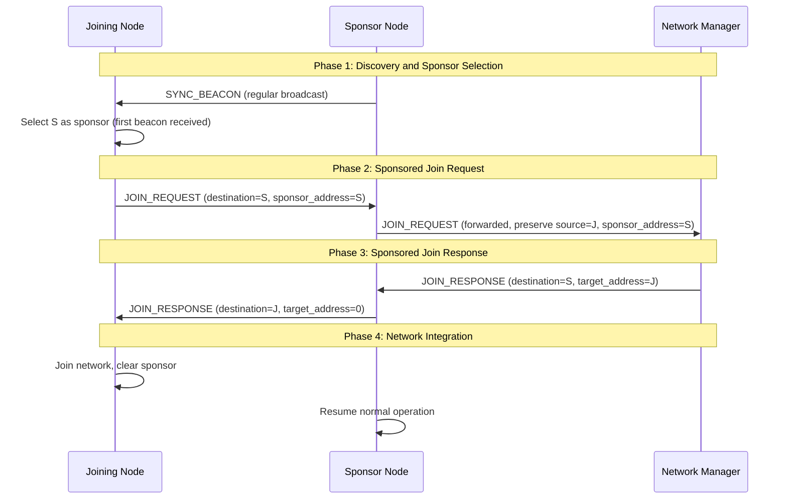
```mermaid
sequenceDiagram
    participant J as Joining Node
    participant S as Sponsor Node
    participant M as Network Manager

    Note over J,M: Phase 1: Discovery and Sponsor Selection
    S->>J: SYNC_BEACON (regular broadcast)
    J->>J: Select S as sponsor (first beacon received)

    Note over J,M: Phase 2: Sponsored Join Request
    J->>S: JOIN_REQUEST (destination=S, sponsor_address=S)
    S->>M: JOIN_REQUEST (forwarded, preserve source=J, sponsor_address=S)

    Note over J,M: Phase 3: Sponsored Join Response
    M->>S: JOIN_RESPONSE (destination=S, target_address=J)
    S->>J: JOIN_RESPONSE (destination=J, target_address=0)

    Note over J,M: Phase 4: Network Integration
    J->>J: Join network, clear sponsor
    S->>S: Resume normal operation
```

#### 6.4.3 Message Routing Semantics

**Key Routing Distinctions (v1.2)**:
- **destination**: Immediate next hop for message routing
- **target_address**: Final recipient for end-to-end delivery
- **sponsor_address**: Intermediate node facilitating join

**Join Request Routing**:
```cpp
// Joining node creates request
JOIN_REQUEST msg = {
    .destination = selected_sponsor_,     // Route to sponsor first
    .source = node_address_,              // Original requester
    .sponsor_address = selected_sponsor_  // Sponsor identification
};

// Sponsor forwards to Network Manager
JOIN_REQUEST forwarded = {
    .destination = network_manager_,      // Route to NM
    .source = msg.source,                 // Preserve original source
    .sponsor_address = msg.sponsor_address // Preserve sponsor info
};
```

**Join Response Routing**:
```cpp
// Network Manager responds via sponsor
JOIN_RESPONSE response = {
    .destination = sponsor_address,       // Route to sponsor
    .source = network_manager_,           // Response from NM
    .target_address = joining_node        // Final recipient
};

// Sponsor forwards to joining node
JOIN_RESPONSE final = {
    .destination = target_address,        // Route to joining node
    .source = response.source,            // Preserve NM source
    .target_address = 0                   // Clear sponsor info
};
```

#### 6.4.4 Special Cases and Error Handling

**Network Manager as Sponsor**:
When the Network Manager is also the sponsor (sponsor_address == node_address_):
```cpp
if (sponsor_address == node_address_) {
    // Direct routing - we ARE the sponsor
    response_destination = joining_node;
    target_address = 0;  // No forwarding needed
} else {
    // External sponsor - route via sponsor
    response_destination = sponsor_address;
    target_address = joining_node;
}
```

**Sponsor Failure Recovery**:
- If sponsor becomes unreachable, joining node returns to DISCOVERY state
- Clear sponsor selection and restart discovery process
- Future enhancement: Multi-hop sponsor chains for better reliability

**Circular Routing Prevention**:
- Network Manager detects when it is both sender and sponsor
- Direct routing bypasses sponsor mechanism in this case
- Prevents infinite routing loops

#### 6.4.5 Benefits and Applications

**Network Expansion**:
- Enables nodes beyond direct Network Manager range to join
- Creates more robust network topologies
- Reduces dependency on central Network Manager proximity

**Reliability Improvements**:
- Multiple potential sponsors increase join success rates
- Sponsor-based forwarding provides redundant paths
- Graceful fallback to discovery on sponsor failure

**Scalability Enhancement**:
- Distributes join processing load across sponsor nodes
- Enables hierarchical network formation
- Supports larger geographic coverage areas

---

## 7. Packet Structure

### 7.1 Physical Layer Frame

```
┌─────────────────────────────────────────────────────────────────┐
│                        LoRa PHY Header                         │
├─────────────────────────────────────────────────────────────────┤
│                     LoRaMesher Frame                           │
├─────────────────────────────────────────────────────────────────┤
│                        LoRa PHY CRC                            │
└─────────────────────────────────────────────────────────────────┘
```

### 7.2 LoRaMesher Frame Structure

```
 0                   1                   2                   3
 0 1 2 3 4 5 6 7 8 9 0 1 2 3 4 5 6 7 8 9 0 1 2 3 4 5 6 7 8 9 0 1
├─┼─┼─┼─┼─┼─┼─┼─┼─┼─┼─┼─┼─┼─┼─┼─┼─┼─┼─┼─┼─┼─┼─┼─┼─┼─┼─┼─┼─┼─┼─┼─┤
│     Message Type    │     Flags     │         Source Node       │
├─┼─┼─┼─┼─┼─┼─┼─┼─┼─┼─┼─┼─┼─┼─┼─┼─┼─┼─┼─┼─┼─┼─┼─┼─┼─┼─┼─┼─┼─┼─┼─┤
│      Destination Node (optional)     │   TTL   │ Seq Number (H) │
├─┼─┼─┼─┼─┼─┼─┼─┼─┼─┼─┼─┼─┼─┼─┼─┼─┼─┼─┼─┼─┼─┼─┼─┼─┼─┼─┼─┼─┼─┼─┼─┤
│ Seq Number (L) │ Payload Length │          Payload...         │
├─┼─┼─┼─┼─┼─┼─┼─┼─┼─┼─┼─┼─┼─┼─┼─┼─┼─┼─┼─┼─┼─┼─┼─┼─┼─┼─┼─┼─┼─┼─┼─┤
│                         ...Payload...                          │
├─┼─┼─┼─┼─┼─┼─┼─┼─┼─┼─┼─┼─┼─┼─┼─┼─┼─┼─┼─┼─┼─┼─┼─┼─┼─┼─┼─┼─┼─┼─┼─┤
│   Checksum    │
└─┼─┼─┼─┼─┼─┼─┼─┤
```

### 7.3 Header Field Descriptions

| Field | Size | Description |
|-------|------|-------------|
| Message Type | 8 bits | Message category and subtype |
| Flags | 8 bits | Protocol flags (ACK required, priority, etc.) |
| Source Node | 16 bits | Originating node identifier |
| Destination Node | 16 bits | Target node (optional for broadcasts) |
| TTL | 8 bits | Time-to-live (hop limit) |
| Sequence Number | 16 bits | Message sequence number |
| Payload Length | 8 bits | Length of payload data |
| Payload | Variable | Application or protocol data |
| Checksum | 8 bits | XOR checksum of entire frame |

### 7.4 Maximum Frame Sizes

| LoRa Configuration | Max Frame Size | Sync Beacon Size | Data Message Size |
|-------------------|----------------|------------------|-------------------|
| SF7, BW125, CR4/5 | 255 bytes | 21 bytes (optimized) | 246 bytes |
| SF8, BW125, CR4/5 | 255 bytes | 21 bytes (optimized) | 246 bytes |
| SF9, BW125, CR4/5 | 255 bytes | 21 bytes (optimized) | 246 bytes |
| SF10, BW125, CR4/5 | 255 bytes | 21 bytes (optimized) | 246 bytes |
| SF11, BW125, CR4/5 | 255 bytes | 21 bytes (optimized) | 246 bytes |
| SF12, BW125, CR4/5 | 255 bytes | 21 bytes (optimized) | 246 bytes |

*Note: Sync beacons optimized to 21 bytes (36% reduction) for faster transmission and lower power consumption. Header overhead is 9 bytes, leaving 246 bytes for data payload.*

---

## 8. Error Handling

### 8.1 Error Classification

#### 8.1.1 Protocol Errors
- **Invalid Message Type**: Unknown or corrupted message type
- **Checksum Failure**: Message integrity check failed
- **Timeout Errors**: Expected responses not received
- **State Violations**: Invalid state transitions

#### 8.1.2 Network Errors
- **Route Unavailable**: No path to destination
- **Network Partition**: Network split detected
- **Synchronization Loss**: TDMA timing lost
- **Slot Conflicts**: Multiple nodes using same slot

#### 8.1.3 Hardware Errors
- **Radio Failure**: LoRa module not responding
- **Transmission Failure**: Message send failed
- **Reception Corruption**: Received message corrupted
- **Resource Exhaustion**: Memory or buffer overflow

### 8.2 Error Recovery Mechanisms

#### 8.2.1 Message-Level Recovery
```cpp
enum class MessageResult {
    SUCCESS,
    CHECKSUM_ERROR,
    TIMEOUT,
    ROUTE_ERROR,
    BUFFER_FULL
};

MessageResult sendMessageWithRetry(const Message& msg, uint8_t maxRetries = 3) {
    for (uint8_t attempt = 0; attempt < maxRetries; attempt++) {
        MessageResult result = sendMessage(msg);
        if (result == SUCCESS) {
            return SUCCESS;
        }
        
        // Exponential backoff
        delay(100 * (1 << attempt));
    }
    return TIMEOUT;
}
```

#### 8.2.2 Route Recovery
```cpp
void handleRouteError(uint16_t destination) {
    // Remove failed route
    removeRoute(destination);
    
    // Broadcast route poison
    broadcastRoutePoison(destination);
    
    // Trigger route discovery if needed
    if (hasPendingTraffic(destination)) {
        initiateRouteDiscovery(destination);
    }
}
```

#### 8.2.3 Network Recovery
```cpp
void handleNetworkPartition() {
    // Clear stale routing information
    purgeStaleRoutes();
    
    // Reset synchronization
    resetSynchronization();
    
    // Return to discovery mode
    changeState(DISCOVERY);
    
    // Attempt network healing
    broadcastNetworkHealingBeacon();
}
```

---

## 9. Performance Characteristics

### 9.1 Timing Requirements

| Parameter | Minimum | Typical | Maximum | Units |
|-----------|---------|---------|---------|-------|
| Slot Duration | 500 | 1000 | 5000 | ms |
| Superframe Duration | 4000 | 8000 | 40000 | ms |
| Route Update Interval | 5000 | 10000 | 30000 | ms |
| Join Timeout | 5000 | 10000 | 30000 | ms |
| Sync Tolerance | 50 | 100 | 500 | ms |

### 9.2 Scalability Limits

| Parameter | Current Limit | Design Limit | Notes |
|-----------|---------------|--------------|-------|
| Network Size | 16 nodes | 65535 nodes | Limited by 16-bit node IDs |
| Slots per Superframe | 8 | 255 | Configurable via SuperframeConfig |
| Routes per Node | 50 | 255 | Memory-dependent |
| Message Queue Depth | 10 | 255 | Per-slot queue |
| Hop Count Limit | 15 | 255 | Prevents routing loops |

### 9.3 LoRa Air Time Calculations

| Frame Size | SF7 | SF8 | SF9 | SF10 | SF11 | SF12 |
|------------|-----|-----|-----|------|------|------|
| 21 bytes (Sync Beacon) | 25ms | 46ms | 82ms | 164ms | 329ms | 658ms |
| 50 bytes | 51ms | 103ms | 185ms | 371ms | 741ms | 1.4s |
| 100 bytes | 82ms | 144ms | 267ms | 535ms | 1.0s | 2.1s |
| 200 bytes | 144ms | 267ms | 493ms | 989ms | 1.9s | 3.9s |
| 255 bytes | 185ms | 329ms | 616ms | 1.2s | 2.4s | 4.9s |

*Calculated for BW=125kHz, CR=4/5, with 8-byte preamble. Optimized sync beacons significantly reduce air time and power consumption.*

### 9.4 Memory Usage

#### 9.4.1 Static Memory (per node)
- **Protocol State**: ~100 bytes
- **Configuration**: ~200 bytes  
- **Service Objects**: ~500 bytes
- **Total Static**: ~800 bytes

#### 9.4.2 Dynamic Memory (per node)
- **Routing Table**: ~50 routes × 16 bytes = 800 bytes
- **Message Queues**: ~10 messages × 255 bytes = 2.5KB
- **Network State**: ~300 bytes
- **Total Dynamic**: ~3.6KB

#### 9.4.3 Total Memory Footprint
- **ESP32 Usage**: ~4.4KB RAM + ~50KB Flash
- **Acceptable for**: ESP32 with >100KB RAM available

---

## 10. Future Work and Research Directions

### 10.1 Open Research Questions

#### 10.1.1 Join Message Forwarding
**Problem**: Evaluate how join_request and join_response should be forwarded through the network. Multiple devices would receive the message and we need to ensure that only one message is forwarded.

**Research Direction**: 
- Use next_hop when joining a network to prevent duplicate forwarding
- Implement forwarding priority based on link quality or hop count
- Develop collision detection mechanisms for join message forwarding

#### 10.1.2 Superframe Initiation Timing
**Problem**: Evaluate how the superframe is being started when a sync beacon is received.

**Research Direction**:
- Analyze timing accuracy requirements for superframe alignment
- Develop adaptive timing correction algorithms
- Study impact of propagation delay on superframe synchronization

#### 10.1.3 Collision Mitigation for Same-Hop Forwarders
**Problem**: We need to think how collision mitigation for same-hop forwarders would be implemented.

**Research Direction**:
- **LoRa Parameter Diversity**: Different hops use SF7, SF8, SF9
- **Frequency Separation**: Each hop uses different frequency channels  
- **Power Optimization**: Closer hops use lower power to reduce interference
- **Temporal Collision Reduction**: 0-50ms random delay for same-hop forwarders
- **Slot Subdivision**: Divide forwarding slots into sub-intervals
- **Capture Effect Utilization**: Stronger signals dominate in LoRa collisions

### 10.2 Implementation and Testing Requirements

#### 10.2.1 Critical Testing Needs
- **Collision Mitigation Testing**: Test the collision mitigation in a separate test to ensure this works, as it is a really critical part of the code
- **Multi-Node Network Simulation**: Validate protocol behavior in 2-50 node networks
- **Real-World Deployment**: Field testing in various environmental conditions

#### 10.2.2 Regulatory Compliance
- **Duty Cycle Configuration**: Ensure regulations compliance with configurable duty cycle limits
- **Power Output Control**: Adaptive power control to meet regional regulations
- **Frequency Management**: Dynamic frequency selection within ISM bands

### 10.3 System Architecture Evolution

#### 10.3.1 Service Decomposition
**Problem**: Separate network_service.cpp into different files. 

**Research Direction**:
- **Superframe Service**: Slot allocations inside the superframe_service
- **Routing Service**: Distance-vector routing logic separation
- **Join Management Service**: Dedicated service for network joining
- **Power Management Service**: Battery-aware scheduling and power optimization

#### 10.3.2 Advanced Power Management
- **Battery-Aware Scheduling**: Dynamic slot allocation based on battery levels
- **Network-Wide Power Optimization**: Coordinated power saving across all nodes
- **Emergency Wake-Up Protocols**: Critical message delivery during sleep periods

### 10.4 Protocol Extensions

#### 10.4.1 Security Enhancements
- **Message Authentication**: Cryptographic message integrity
- **Key Distribution**: Secure key exchange mechanisms
- **Network Access Control**: Authentication for network joining

#### 10.4.2 Quality of Service
- **Priority-Based Routing**: Different service levels for message types
- **Bandwidth Allocation**: Guaranteed bandwidth for critical applications
- **Latency Optimization**: Real-time message delivery guarantees

#### 10.4.3 Scalability Improvements
- **Hierarchical Network Management**: Multiple network managers for large networks
- **Network Clustering**: Logical network partitioning for improved scalability
- **Inter-Network Communication**: Bridge protocols between multiple mesh networks

### 10.5 Performance Optimization

#### 10.5.1 Adaptive Algorithms
- **Dynamic Slot Allocation**: Real-time adjustment based on traffic patterns
- **Intelligent Route Selection**: Machine learning for optimal path selection
- **Predictive Maintenance**: Proactive detection of network issues

#### 10.5.2 Energy Efficiency Research
- **Ultra-Low Power Modes**: Sub-milliwatt sleep states
- **Energy Harvesting Integration**: Solar/RF energy harvesting support
- **Lifetime Prediction**: Battery life estimation and optimization

---

## 11. Conclusion

The LoRaMesher protocol provides a robust, scalable solution for LoRa mesh networking with the following key features:

### Core Capabilities
- **Reliable Routing**: Distance-vector algorithm with link quality metrics and deterministic control slot allocation
- **Power-Aware TDMA**: 70% sleep time with 30% target duty cycle for battery-powered operation
- **Multi-Hop Synchronization**: Collision-free hop-layered sync beacon forwarding with 36% message size optimization
- **Scalable Architecture**: Service-oriented design supporting 2-50 node networks efficiently

### Advanced Features
- **Optimized Sync Beacons**: 21-byte messages (reduced from 33 bytes) for faster transmission and lower power consumption
- **Deterministic Slot Allocation**: Address-based ordering ensures all nodes calculate identical schedules
- **Hop-Layered Forwarding**: Sequential transmission by hop distance eliminates inter-hop collisions
- **Network Synchronization**: Hierarchical timing coordination with ±50ms accuracy across multi-hop networks

### Technical Specifications
- **Message Efficiency**: Sync beacons use only 25ms air time (SF7) vs 51ms for standard messages
- **Power Optimization**: Target duty cycle of 30% with adaptive superframe sizing
- **Network Scalability**: Supports up to 255 nodes with configurable parameters
- **Memory Footprint**: ~4.4KB RAM usage suitable for ESP32 deployment

The protocol is specifically designed for embedded systems with limited resources while maintaining the flexibility to scale to larger networks. The recent optimizations in sync beacon efficiency and power-aware slot allocation make it particularly suitable for battery-powered IoT deployments requiring long operational lifetimes.

**Current Status**: Academic specification complete with ongoing implementation enhancements for power efficiency and multi-hop synchronization reliability.