# LoRaMesher Protocol Specification

**Version**: 1.0  
**Last Updated**: 2025-06-30  
**Protocol Type**: Distance-Vector Mesh Routing with TDMA

This document provides the complete technical specification for the LoRaMesher protocol, a distance-vector routing protocol designed for LoRa mesh networks with TDMA coordination.

## Table of Contents

1. [Protocol Overview](#1-protocol-overview)
2. [State Machine Specification](#2-state-machine-specification)
3. [Message Format Specification](#3-message-format-specification)
4. [Routing Algorithm](#4-routing-algorithm)
5. [Network Synchronization (TDMA)](#5-network-synchronization-tdma)
6. [Network Discovery & Joining](#6-network-discovery--joining)
7. [Packet Structure](#7-packet-structure)
8. [Error Handling](#8-error-handling)
9. [Performance Characteristics](#9-performance-characteristics)

---

## 1. Protocol Overview

### 1.1 Design Principles

LoRaMesher is designed around these core principles:

- **Distance-Vector Routing**: Each node maintains routing tables with hop counts and link quality metrics
- **TDMA Coordination**: Time-division multiple access prevents collisions and enables network synchronization
- **Service-Oriented Architecture**: Protocol functionality is separated into distinct services
- **Hierarchical Network Management**: Special network manager nodes coordinate timing and topology
- **Adaptive Link Quality**: Multiple metrics determine optimal routing paths

### 1.2 Network Architecture

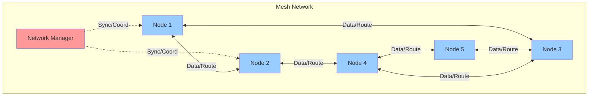

### 1.3 Protocol Stack

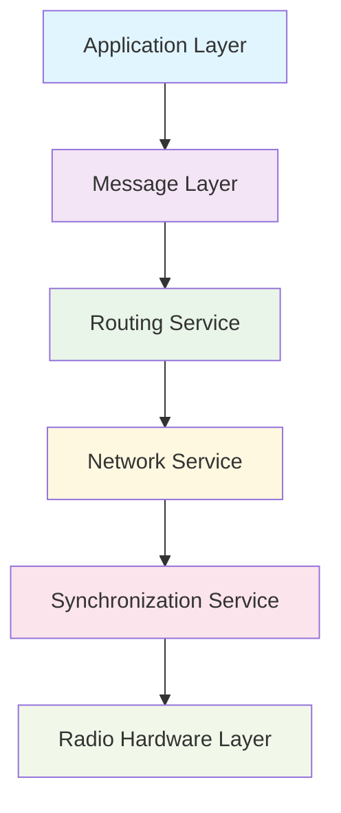

---

## 2. State Machine Specification

### 2.1 Protocol States

The LoRaMesher protocol operates in six distinct states:

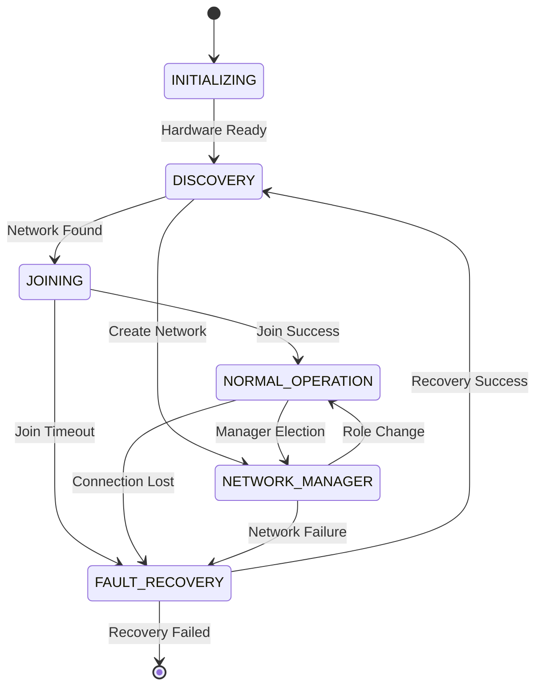

### 2.2 State Descriptions

#### INITIALIZING
- **Purpose**: System startup and hardware configuration
- **Duration**: 1-5 seconds
- **Activities**: 
  - Initialize radio hardware
  - Load configuration parameters
  - Start protocol services
- **Transitions**: 
  - Success → `DISCOVERY`
  - Failure → Protocol termination

#### DISCOVERY
- **Purpose**: Find existing networks or create new one
- **Duration**: 10-30 seconds (configurable)
- **Activities**:
  - Listen for network beacons
  - Broadcast discovery messages
  - Evaluate network options
- **Transitions**:
  - Network found → `JOINING`
  - Timeout with no networks → `NETWORK_MANAGER`
  - Critical error → `FAULT_RECOVERY`

#### JOINING
- **Purpose**: Connect to discovered network
- **Duration**: 5-15 seconds
- **Activities**:
  - Send join request to network manager
  - Negotiate slot assignment
  - Synchronize with network timing
- **Transitions**:
  - Join successful → `NORMAL_OPERATION`
  - Join failed/timeout → `FAULT_RECOVERY`

#### NORMAL_OPERATION
- **Purpose**: Standard data communication and routing
- **Duration**: Indefinite
- **Activities**:
  - Process and forward data messages
  - Maintain routing tables
  - Participate in network synchronization
- **Transitions**:
  - Elected as manager → `NETWORK_MANAGER`
  - Connection loss → `FAULT_RECOVERY`

#### NETWORK_MANAGER
- **Purpose**: Coordinate network timing and topology
- **Duration**: Indefinite
- **Activities**:
  - Broadcast synchronization beacons
  - Manage slot allocations
  - Handle join requests
  - Coordinate routing updates
- **Transitions**:
  - Role transferred → `NORMAL_OPERATION`
  - Network failure → `FAULT_RECOVERY`

#### FAULT_RECOVERY
- **Purpose**: Handle connection loss and network failures
- **Duration**: 30-60 seconds
- **Activities**:
  - Attempt to reconnect to known networks
  - Clear stale routing information
  - Reset synchronization state
- **Transitions**:
  - Recovery successful → `DISCOVERY`
  - Recovery failed → Protocol termination

### 2.3 State Transition Triggers

| From State | To State | Trigger | Condition |
|------------|----------|---------|-----------|
| INITIALIZING | DISCOVERY | Hardware Ready | Radio initialized successfully |
| DISCOVERY | JOINING | Network Found | Valid beacon received |
| DISCOVERY | NETWORK_MANAGER | Timeout | No networks found after timeout |
| JOINING | NORMAL_OPERATION | Join Success | JOIN_RESPONSE received |
| JOINING | FAULT_RECOVERY | Join Timeout | No response to JOIN_REQUEST |
| NORMAL_OPERATION | NETWORK_MANAGER | Manager Election | Current manager lost |
| NORMAL_OPERATION | FAULT_RECOVERY | Connection Lost | No valid messages for timeout period |
| NETWORK_MANAGER | NORMAL_OPERATION | Role Change | Another node elected manager |
| FAULT_RECOVERY | DISCOVERY | Recovery Success | Ready to rejoin network |

---

## 3. Message Format Specification

### 3.1 Message Type Organization

Messages are organized in a hierarchical 16×16 structure:

```cpp
// Message categories (upper 4 bits)
DATA_MESSAGE    = 0x10,  // Application data transmission
CONTROL_MESSAGE = 0x20,  // Protocol control and management
ROUTING_MESSAGE = 0x30,  // Routing table updates
SYSTEM_MESSAGE  = 0x40,  // System management and diagnostics
```

### 3.2 Core Message Types

#### 3.2.1 Join Messages
```cpp
// Join process messages
JOIN_REQUEST  = 0x21,  // Request to join network
JOIN_RESPONSE = 0x22,  // Response to join request
```

**JOIN_REQUEST Format**:
```cpp
struct JoinRequest {
    uint8_t messageType;     // 0x21
    uint16_t nodeId;         // Requesting node ID
    uint8_t capabilities;    // Node capability flags
    uint16_t networkId;      // Target network ID (0 for any)
    uint8_t requestedSlots;  // Number of slots requested
    uint8_t checksum;        // Message integrity check
};
```

**JOIN_RESPONSE Format**:
```cpp
struct JoinResponse {
    uint8_t messageType;     // 0x22
    uint16_t nodeId;         // Target node ID
    uint8_t status;          // JOIN_ACCEPTED(0) or JOIN_DENIED(1)
    uint16_t assignedSlot;   // Allocated slot number
    uint32_t superframeTime; // Current superframe timing
    uint16_t networkId;      // Network identification
    uint8_t checksum;        // Message integrity check
};
```

#### 3.2.2 Routing Messages
```cpp
// Routing protocol messages
ROUTING_UPDATE = 0x31,  // Distance-vector routing update
ROUTE_REQUEST  = 0x32,  // Route discovery request
ROUTE_RESPONSE = 0x33,  // Route discovery response
```

**ROUTING_UPDATE Format**:
```cpp
struct RoutingUpdate {
    uint8_t messageType;     // 0x31
    uint16_t originNode;     // Node sending update
    uint8_t numRoutes;       // Number of routes in update
    uint32_t superframeTime; // Network synchronization time
    
    struct RouteEntry {
        uint16_t destination; // Destination node ID
        uint8_t hops;        // Hop count to destination
        uint8_t linkQuality; // Link quality metric (0-255)
        uint16_t nextHop;    // Next hop node ID
        uint32_t timestamp;  // Route freshness timestamp
    } routes[MAX_ROUTES_PER_UPDATE];
    
    uint8_t checksum;        // Message integrity check
};
```

#### 3.2.3 Data Messages
```cpp
// Application data messages
DATA_UNICAST   = 0x11,  // Point-to-point data
DATA_BROADCAST = 0x12,  // Network-wide broadcast
DATA_MULTICAST = 0x13,  // Group communication
```

**DATA_UNICAST Format**:
```cpp
struct DataUnicast {
    uint8_t messageType;     // 0x11
    uint16_t sourceNode;     // Originating node
    uint16_t destinationNode;// Target node
    uint8_t ttl;            // Time-to-live (hop limit)
    uint16_t sequenceNumber; // Message sequence number
    uint8_t payloadLength;   // Length of application data
    uint8_t payload[MAX_PAYLOAD_SIZE]; // Application data
    uint8_t checksum;        // Message integrity check
};
```

### 3.3 Message Serialization

All messages use little-endian byte order and are serialized using the following process:

1. **Header Creation**: Message type and routing information
2. **Payload Serialization**: Application data with length prefix
3. **Checksum Calculation**: Simple XOR checksum of all bytes
4. **Size Validation**: Ensure total size ≤ 255 bytes (LoRa constraint)

---

## 4. Routing Algorithm

### 4.0 Routing Update Propagation Sequence

The following diagram shows how routing updates propagate through the network:

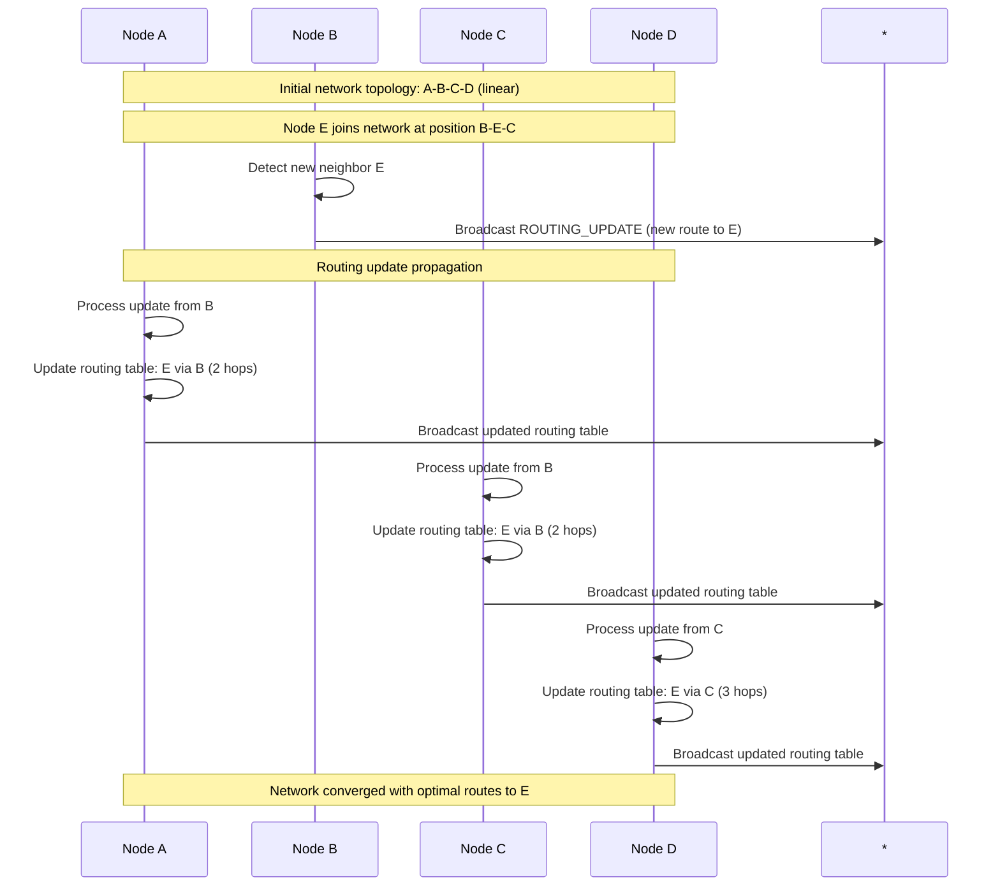

### 4.1 Data Message Multi-Hop Forwarding

This diagram illustrates how data messages are forwarded through multiple hops:

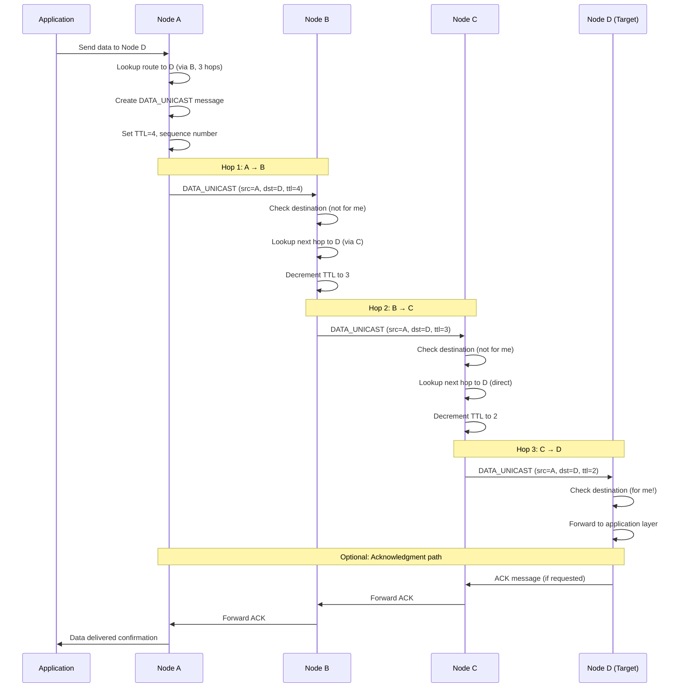

---

## 4. Routing Algorithm

### 4.1 Distance-Vector Algorithm

LoRaMesher implements a modified Bellman-Ford distance-vector routing algorithm optimized for wireless mesh networks.

#### 4.1.1 Routing Table Structure

```cpp
struct RouteEntry {
    uint16_t destination;    // Destination node ID
    uint16_t nextHop;       // Next hop to reach destination
    uint8_t hops;           // Hop count (primary metric)
    uint8_t linkQuality;    // Link quality (secondary metric)
    uint32_t lastUpdate;    // Timestamp of last update
    uint8_t flags;          // Route flags (valid, temporary, etc.)
};
```

#### 4.1.2 Route Calculation

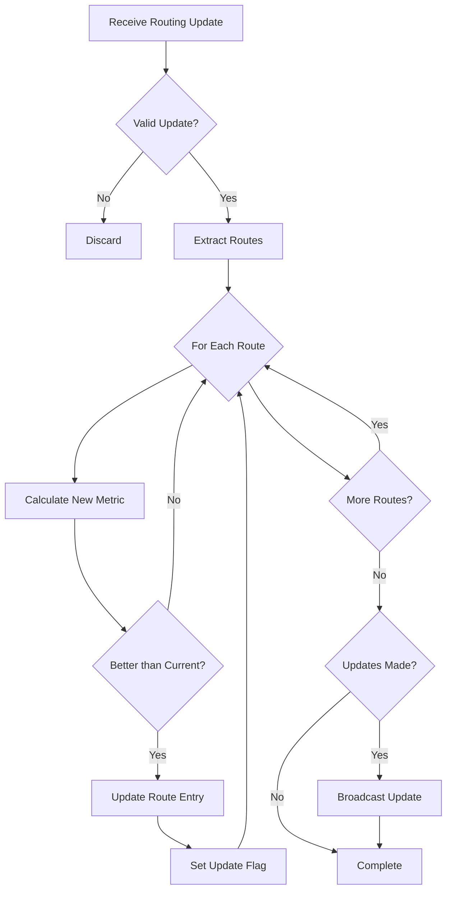

#### 4.1.3 Metric Calculation

**Primary Metric - Hop Count**:
```cpp
uint8_t newHops = receivedHops + 1;
if (newHops > MAX_HOPS) {
    // Route invalid due to hop limit
    return INVALID_ROUTE;
}
```

**Secondary Metric - Link Quality**:
```cpp
uint8_t combinedQuality = (receivedLinkQuality + localLinkQuality) / 2;
if (combinedQuality < MIN_QUALITY_THRESHOLD) {
    // Route below quality threshold
    return POOR_QUALITY_ROUTE;
}
```

**Route Comparison**:
```cpp
bool isBetterRoute(const RouteEntry& current, const RouteEntry& candidate) {
    // Primary comparison: hop count
    if (candidate.hops < current.hops) return true;
    if (candidate.hops > current.hops) return false;
    
    // Secondary comparison: link quality
    return candidate.linkQuality > current.linkQuality;
}
```

### 4.2 Loop Prevention

**Split Horizon**: Don't advertise routes back to the node that provided them
```cpp
void SendRoutingUpdate(uint16_t targetNode) {
    for (auto& route : routingTable) {
        if (route.nextHop != targetNode) {
            // Only advertise if not learned from target
            includeInUpdate(route);
        }
    }
}
```

**Route Poisoning**: Advertise unreachable routes with infinite metric
```cpp
void PoisonRoute(uint16_t destination) {
    RouteEntry poisonRoute;
    poisonRoute.destination = destination;
    poisonRoute.hops = INFINITE_HOPS;
    poisonRoute.linkQuality = 0;
    broadcastRoutingUpdate(poisonRoute);
}
```

### 4.3 Route Aging

Routes are aged out if not refreshed within the configured timeout:

```cpp
void AgeRoutes() {
    uint32_t currentTime = getCurrentTime();
    for (auto& route : routingTable) {
        if (currentTime - route.lastUpdate > ROUTE_TIMEOUT) {
            if (route.flags & ROUTE_PERMANENT) {
                continue; // Don't age permanent routes
            }
            removeRoute(route.destination);
            broadcastRoutePoison(route.destination);
        }
    }
}
```

### 4.5 Network Topology Examples and Routing Behavior

This section demonstrates how the routing algorithm performs in different network topologies.

#### 4.5.1 Linear Network Topology

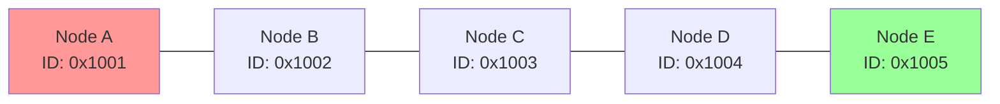

**Routing Table at Node A:**
| Destination | Next Hop | Hops | Link Quality |
|-------------|----------|------|--------------|
| 0x1002      | 0x1002   | 1    | 220          |
| 0x1003      | 0x1002   | 2    | 180          |
| 0x1004      | 0x1002   | 3    | 150          |
| 0x1005      | 0x1002   | 4    | 120          |

**Data Flow A → E:** A → B → C → D → E (4 hops)

#### 4.5.2 Mesh Network Topology

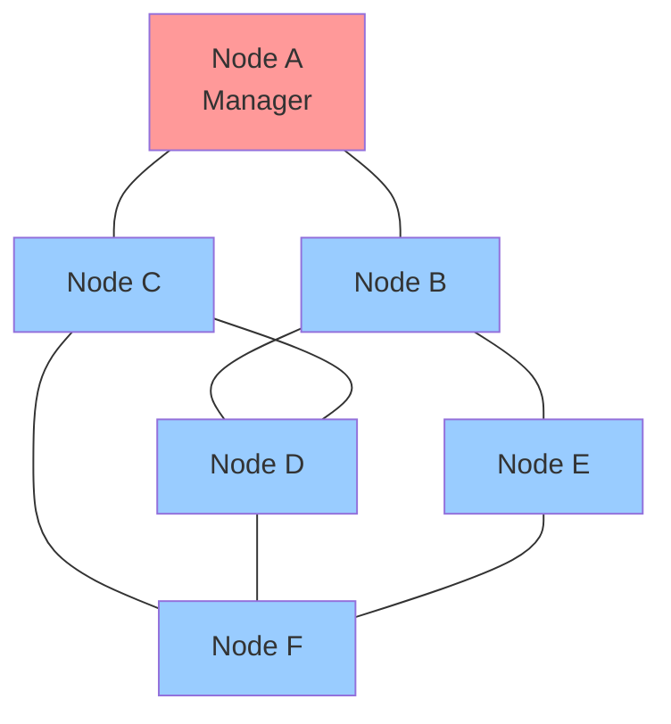

**Routing Table at Node A (Multiple Path Options):**
| Destination | Primary Route | Backup Route | Hops | Quality |
|-------------|---------------|--------------|------|---------|
| 0x1002      | Direct        | via C        | 1    | 240     |
| 0x1003      | Direct        | via B        | 1    | 230     |
| 0x1004      | via B         | via C        | 2    | 200     |
| 0x1005      | via B         | via C→D      | 2    | 190     |
| 0x1006      | via C         | via B→D      | 2    | 200     |

**Optimal Data Paths from A:**
- A → D: A → B → D (2 hops) or A → C → D (2 hops)
- A → E: A → B → E (2 hops, preferred due to higher link quality)
- A → F: A → C → F (2 hops, preferred due to higher link quality)

#### 4.5.3 Star Network Topology

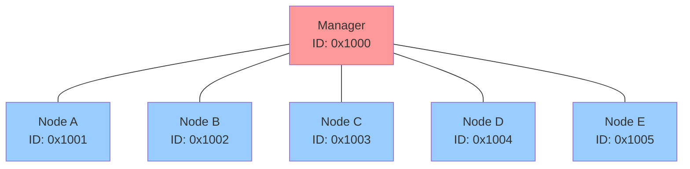

**Routing Table at Node A:**
| Destination | Next Hop | Hops | Link Quality |
|-------------|----------|------|--------------|
| 0x1000      | 0x1000   | 1    | 250          |
| 0x1002      | 0x1000   | 2    | 200          |
| 0x1003      | 0x1000   | 2    | 195          |
| 0x1004      | 0x1000   | 2    | 205          |
| 0x1005      | 0x1000   | 2    | 190          |

**Characteristics:**
- Single point of failure (Manager)
- All inter-node communication requires 2 hops
- Optimal for centralized control scenarios
- Manager handles all routing decisions

#### 4.5.4 Partitioned Network Recovery

This example shows how the network handles and recovers from partitions:

**Before Partition:**
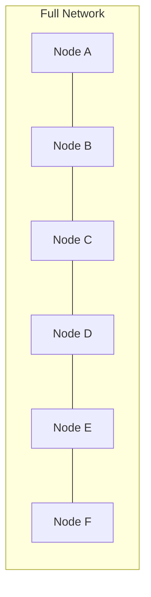

**During Partition (Link C-D Failed):**
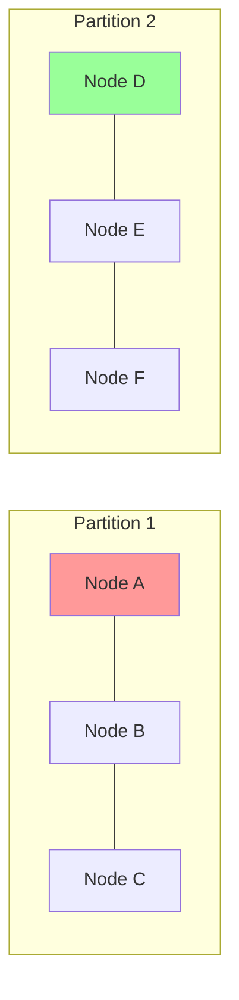

**After Healing (Alternative Path A-G-F Discovered):**
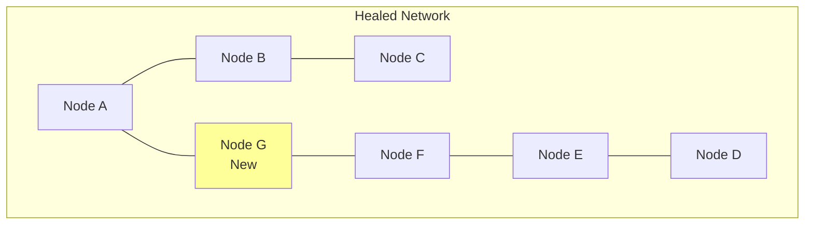

**Route Changes During Healing:**
| Phase | A→D Route | Hops | Status |
|-------|-----------|------|--------|
| Normal | A→B→C→D | 3 | Active |
| Partition | No route | ∞ | Failed |
| Healing | A→G→F→E→D | 4 | Restored |

#### 4.5.5 Load Balancing Example

In networks with multiple equal-cost paths, the protocol can distribute traffic:

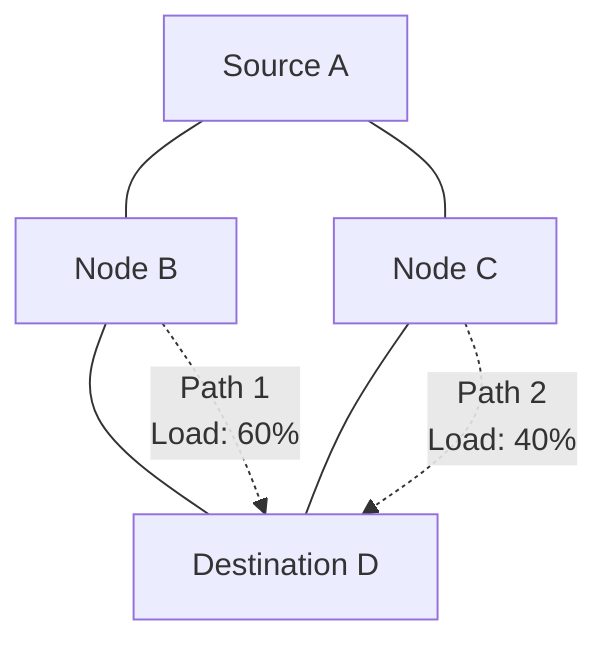

**Load Distribution Logic:**
```cpp
struct LoadBalancing {
    struct PathMetrics {
        uint8_t hops;
        uint8_t linkQuality;
        uint8_t currentLoad;    // 0-100%
        uint32_t lastUsed;
    };
    
    uint16_t selectNextHop(uint16_t destination) {
        auto equalCostPaths = findEqualCostPaths(destination);
        
        // Weighted selection based on current load
        uint16_t selectedPath = 0;
        uint8_t minLoad = 255;
        
        for (auto& path : equalCostPaths) {
            if (path.currentLoad < minLoad) {
                minLoad = path.currentLoad;
                selectedPath = path.nextHop;
            }
        }
        
        return selectedPath;
    }
};
```

---

## 5. Network Synchronization (TDMA)

### 5.1 Superframe Structure

The TDMA system organizes time into superframes divided into slots:

```mermaid
gantt
    title Superframe Structure (Example: 8 slots)
    dateFormat X
    axisFormat %s
    
    section Superframe
    Slot 0 (Manager)    :0, 1000
    Slot 1 (Node A)     :1000, 2000
    Slot 2 (Node B)     :2000, 3000
    Slot 3 (Node C)     :3000, 4000
    Slot 4 (Node D)     :4000, 5000
    Slot 5 (Node E)     :5000, 6000
    Slot 6 (Open)       :6000, 7000
    Slot 7 (Open)       :7000, 8000
```

### 5.2 Timing Parameters

```cpp
struct SuperframeConfig {
    uint16_t slotDuration;      // Duration of each slot (ms)
    uint8_t slotsPerSuperframe; // Number of slots in superframe
    uint32_t superframeDuration; // Total superframe duration (ms)
    uint8_t guardTime;          // Guard time between slots (ms)
    uint32_t syncTolerance;     // Acceptable sync drift (ms)
};

// Default configuration
SuperframeConfig defaultConfig = {
    .slotDuration = 1000,       // 1 second per slot
    .slotsPerSuperframe = 8,    // 8 slots total
    .superframeDuration = 8000, // 8 second superframe
    .guardTime = 50,            // 50ms guard time
    .syncTolerance = 100        // 100ms sync tolerance
};
```

### 5.3 Synchronization Protocol

#### 5.3.1 Network Manager Synchronization

The network manager broadcasts synchronization information in slot 0:

```cpp
struct SyncMessage {
    uint8_t messageType;        // SYNC_BEACON (0x41)
    uint16_t managerId;         // Network manager node ID
    uint32_t superframeTime;    // Current superframe timestamp
    uint16_t superframeNumber;  // Superframe sequence number
    uint8_t activeSlots;        // Bitmap of active slots
    uint8_t checksum;           // Message integrity
};
```

#### 5.3.2 Time Synchronization Algorithm

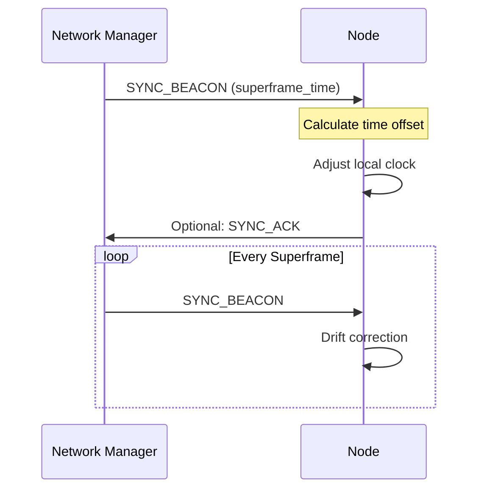

**Clock Adjustment Logic**:
```cpp
void ProcessSyncBeacon(const SyncMessage& sync) {
    uint32_t receivedTime = getCurrentLocalTime();
    uint32_t expectedTime = sync.superframeTime;
    int32_t drift = receivedTime - expectedTime;
    
    if (abs(drift) > syncTolerance) {
        // Large drift - hard sync
        setLocalTime(expectedTime);
        logEvent("Hard sync: drift = " + std::to_string(drift));
    } else if (abs(drift) > syncTolerance / 2) {
        // Small drift - gradual adjustment
        adjustClockRate(drift);
        logEvent("Soft sync: drift = " + std::to_string(drift));
    }
    
    lastSyncTime = receivedTime;
}
```

### 5.4 Slot Allocation

#### 5.4.1 Initial Allocation

New nodes request slots during the join process:

1. **Slot Request**: Include desired number of slots in JOIN_REQUEST
2. **Slot Assignment**: Network manager assigns available slots
3. **Slot Confirmation**: Node confirms slot usage in first transmission

#### 5.4.2 Dynamic Reallocation

```cpp
struct SlotRequest {
    uint8_t messageType;     // SLOT_REQUEST (0x23)
    uint16_t nodeId;         // Requesting node
    uint8_t requestedSlots;  // Number of slots needed
    uint8_t priority;        // Request priority (0-255)
    uint8_t reason;          // Reason for request
    uint8_t checksum;        // Message integrity
};
```

### 5.5 Network Manager Election Sequence

When the current network manager fails, a new manager must be elected:

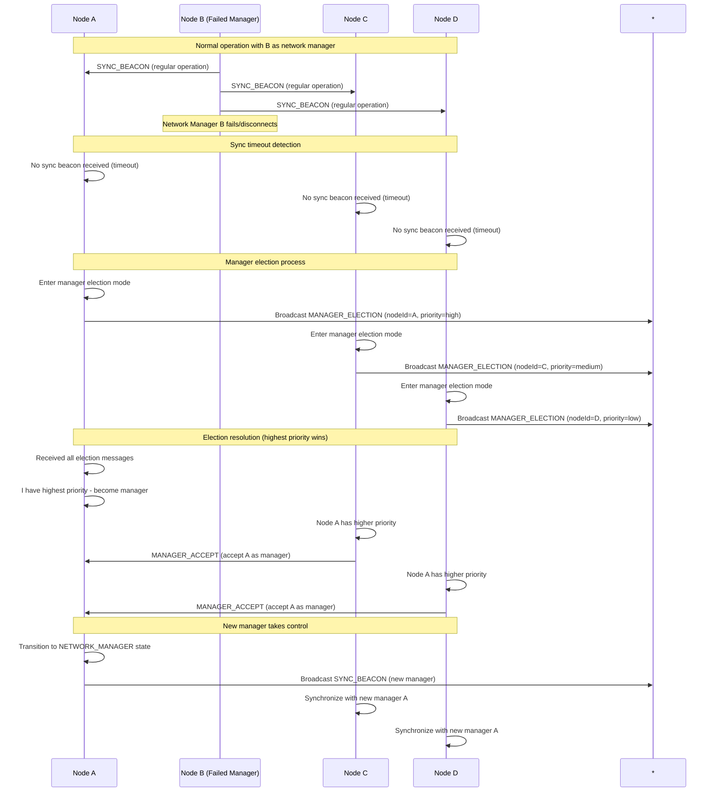

### 5.6 Fault Recovery and Network Healing

This sequence shows how the network recovers from partitions:

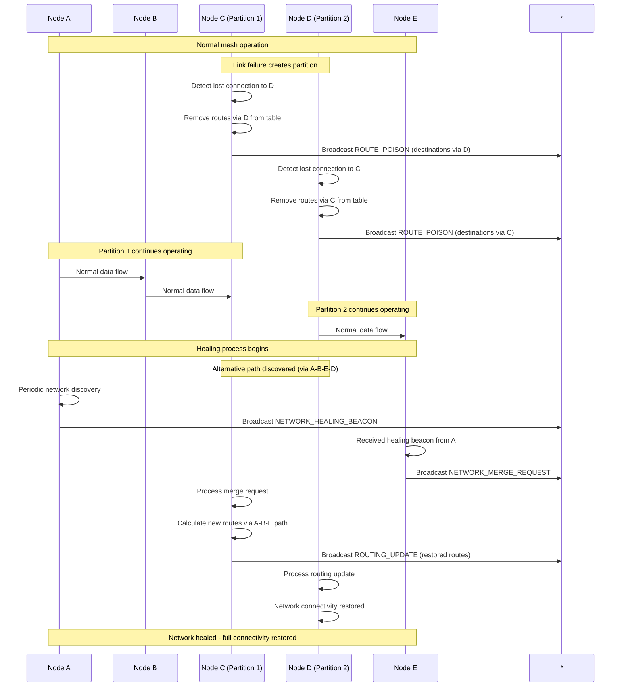

---

## 6. Network Discovery & Joining

### 6.1 Network Discovery Process

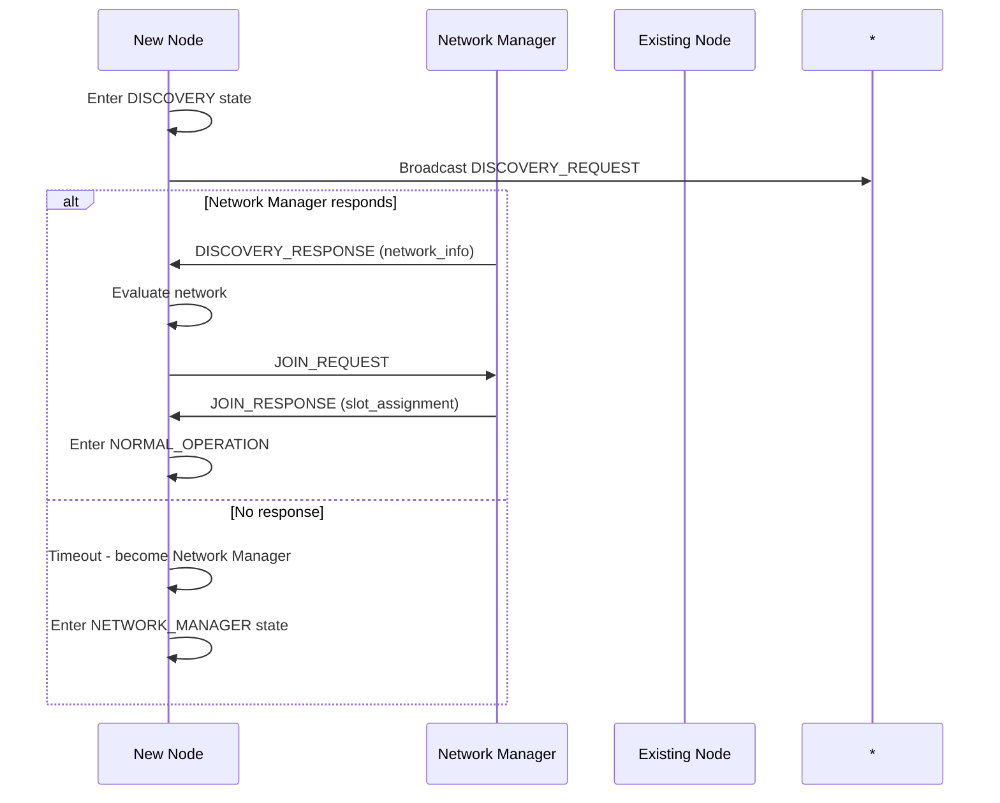

### 6.2 Discovery Messages

#### 6.2.1 Discovery Request
```cpp
struct DiscoveryRequest {
    uint8_t messageType;     // DISCOVERY_REQUEST (0x24)
    uint16_t nodeId;         // Discovering node ID
    uint8_t capabilities;    // Node capabilities
    uint8_t preferredRole;   // Preferred network role
    uint8_t maxHops;         // Maximum network diameter
    uint8_t checksum;        // Message integrity
};
```

#### 6.2.2 Discovery Response
```cpp
struct DiscoveryResponse {
    uint8_t messageType;     // DISCOVERY_RESPONSE (0x25)
    uint16_t managerId;      // Network manager ID
    uint16_t networkId;      // Network identifier
    uint8_t networkSize;     // Number of active nodes
    uint8_t availableSlots;  // Number of free slots
    uint8_t networkQuality;  // Overall network quality
    uint32_t uptime;         // Network uptime
    uint8_t checksum;        // Message integrity
};
```

### 6.3 Join Process

#### 6.3.1 Join Request Handling

```cpp
void ProcessJoinRequest(const JoinRequest& request) {
    // Validate request
    if (!validateJoinRequest(request)) {
        sendJoinResponse(request.nodeId, JOIN_DENIED, "Invalid request");
        return;
    }
    
    // Check available slots
    uint16_t availableSlot = findAvailableSlot();
    if (availableSlot == NO_SLOT_AVAILABLE) {
        sendJoinResponse(request.nodeId, JOIN_DENIED, "No slots available");
        return;
    }
    
    // Assign slot and create response
    assignSlot(request.nodeId, availableSlot);
    sendJoinResponse(request.nodeId, JOIN_ACCEPTED, availableSlot);
    
    // Update network state
    addNodeToNetwork(request.nodeId, availableSlot);
    broadcastNetworkUpdate();
}
```

#### 6.3.2 Join Response Processing

```cpp
void ProcessJoinResponse(const JoinResponse& response) {
    if (response.status == JOIN_ACCEPTED) {
        // Join successful
        assignedSlot = response.assignedSlot;
        networkId = response.networkId;
        synchronizeTime(response.superframeTime);
        
        // Transition to normal operation
        changeState(NORMAL_OPERATION);
        
        // Start slot-based operation
        startSlotScheduler();
    } else {
        // Join denied - return to discovery
        logEvent("Join denied: " + std::string(response.reason));
        changeState(DISCOVERY);
    }
}
```

---

## 7. Packet Structure

### 7.1 Physical Layer Frame

```
┌─────────────────────────────────────────────────────────────────┐
│                        LoRa PHY Header                         │
├─────────────────────────────────────────────────────────────────┤
│                     LoRaMesher Frame                           │
├─────────────────────────────────────────────────────────────────┤
│                        LoRa PHY CRC                            │
└─────────────────────────────────────────────────────────────────┘
```

### 7.2 LoRaMesher Frame Structure

```
 0                   1                   2                   3
 0 1 2 3 4 5 6 7 8 9 0 1 2 3 4 5 6 7 8 9 0 1 2 3 4 5 6 7 8 9 0 1
├─┼─┼─┼─┼─┼─┼─┼─┼─┼─┼─┼─┼─┼─┼─┼─┼─┼─┼─┼─┼─┼─┼─┼─┼─┼─┼─┼─┼─┼─┼─┼─┤
│     Message Type    │     Flags     │         Source Node       │
├─┼─┼─┼─┼─┼─┼─┼─┼─┼─┼─┼─┼─┼─┼─┼─┼─┼─┼─┼─┼─┼─┼─┼─┼─┼─┼─┼─┼─┼─┼─┼─┤
│      Destination Node (optional)     │   TTL   │ Seq Number (H) │
├─┼─┼─┼─┼─┼─┼─┼─┼─┼─┼─┼─┼─┼─┼─┼─┼─┼─┼─┼─┼─┼─┼─┼─┼─┼─┼─┼─┼─┼─┼─┼─┤
│ Seq Number (L) │ Payload Length │          Payload...         │
├─┼─┼─┼─┼─┼─┼─┼─┼─┼─┼─┼─┼─┼─┼─┼─┼─┼─┼─┼─┼─┼─┼─┼─┼─┼─┼─┼─┼─┼─┼─┼─┤
│                         ...Payload...                          │
├─┼─┼─┼─┼─┼─┼─┼─┼─┼─┼─┼─┼─┼─┼─┼─┼─┼─┼─┼─┼─┼─┼─┼─┼─┼─┼─┼─┼─┼─┼─┼─┤
│   Checksum    │
└─┼─┼─┼─┼─┼─┼─┼─┤
```

### 7.3 Header Field Descriptions

| Field | Size | Description |
|-------|------|-------------|
| Message Type | 8 bits | Message category and subtype |
| Flags | 8 bits | Protocol flags (ACK required, priority, etc.) |
| Source Node | 16 bits | Originating node identifier |
| Destination Node | 16 bits | Target node (optional for broadcasts) |
| TTL | 8 bits | Time-to-live (hop limit) |
| Sequence Number | 16 bits | Message sequence number |
| Payload Length | 8 bits | Length of payload data |
| Payload | Variable | Application or protocol data |
| Checksum | 8 bits | XOR checksum of entire frame |

### 7.4 Maximum Frame Sizes

| LoRa Configuration | Max Frame Size | Max Payload Size |
|-------------------|----------------|------------------|
| SF7, BW125, CR4/5 | 255 bytes | 246 bytes |
| SF8, BW125, CR4/5 | 255 bytes | 246 bytes |
| SF9, BW125, CR4/5 | 255 bytes | 246 bytes |
| SF10, BW125, CR4/5 | 255 bytes | 246 bytes |
| SF11, BW125, CR4/5 | 255 bytes | 246 bytes |
| SF12, BW125, CR4/5 | 255 bytes | 246 bytes |

*Note: All LoRa configurations support 255-byte frames. Header overhead is 9 bytes, leaving 246 bytes for payload.*

---

## 8. Error Handling

### 8.1 Error Classification

#### 8.1.1 Protocol Errors
- **Invalid Message Type**: Unknown or corrupted message type
- **Checksum Failure**: Message integrity check failed
- **Timeout Errors**: Expected responses not received
- **State Violations**: Invalid state transitions

#### 8.1.2 Network Errors
- **Route Unavailable**: No path to destination
- **Network Partition**: Network split detected
- **Synchronization Loss**: TDMA timing lost
- **Slot Conflicts**: Multiple nodes using same slot

#### 8.1.3 Hardware Errors
- **Radio Failure**: LoRa module not responding
- **Transmission Failure**: Message send failed
- **Reception Corruption**: Received message corrupted
- **Resource Exhaustion**: Memory or buffer overflow

### 8.2 Error Recovery Mechanisms

#### 8.2.1 Message-Level Recovery
```cpp
enum class MessageResult {
    SUCCESS,
    CHECKSUM_ERROR,
    TIMEOUT,
    ROUTE_ERROR,
    BUFFER_FULL
};

MessageResult sendMessageWithRetry(const Message& msg, uint8_t maxRetries = 3) {
    for (uint8_t attempt = 0; attempt < maxRetries; attempt++) {
        MessageResult result = sendMessage(msg);
        if (result == SUCCESS) {
            return SUCCESS;
        }
        
        // Exponential backoff
        delay(100 * (1 << attempt));
    }
    return TIMEOUT;
}
```

#### 8.2.2 Route Recovery
```cpp
void handleRouteError(uint16_t destination) {
    // Remove failed route
    removeRoute(destination);
    
    // Broadcast route poison
    broadcastRoutePoison(destination);
    
    // Trigger route discovery if needed
    if (hasPendingTraffic(destination)) {
        initiateRouteDiscovery(destination);
    }
}
```

#### 8.2.3 Network Recovery
```cpp
void handleNetworkPartition() {
    // Clear stale routing information
    purgeStaleRoutes();
    
    // Reset synchronization
    resetSynchronization();
    
    // Return to discovery mode
    changeState(DISCOVERY);
    
    // Attempt network healing
    broadcastNetworkHealingBeacon();
}
```

---

## 9. Performance Characteristics

### 9.1 Timing Requirements

| Parameter | Minimum | Typical | Maximum | Units |
|-----------|---------|---------|---------|-------|
| Slot Duration | 500 | 1000 | 5000 | ms |
| Superframe Duration | 4000 | 8000 | 40000 | ms |
| Route Update Interval | 5000 | 10000 | 30000 | ms |
| Join Timeout | 5000 | 10000 | 30000 | ms |
| Sync Tolerance | 50 | 100 | 500 | ms |

### 9.2 Scalability Limits

| Parameter | Current Limit | Design Limit | Notes |
|-----------|---------------|--------------|-------|
| Network Size | 16 nodes | 65535 nodes | Limited by 16-bit node IDs |
| Slots per Superframe | 8 | 255 | Configurable via SuperframeConfig |
| Routes per Node | 50 | 255 | Memory-dependent |
| Message Queue Depth | 10 | 255 | Per-slot queue |
| Hop Count Limit | 15 | 255 | Prevents routing loops |

### 9.3 LoRa Air Time Calculations

| Frame Size | SF7 | SF8 | SF9 | SF10 | SF11 | SF12 |
|------------|-----|-----|-----|------|------|------|
| 50 bytes | 51ms | 103ms | 185ms | 371ms | 741ms | 1.4s |
| 100 bytes | 82ms | 144ms | 267ms | 535ms | 1.0s | 2.1s |
| 200 bytes | 144ms | 267ms | 493ms | 989ms | 1.9s | 3.9s |
| 255 bytes | 185ms | 329ms | 616ms | 1.2s | 2.4s | 4.9s |

*Calculated for BW=125kHz, CR=4/5, with 8-byte preamble*

### 9.4 Memory Usage

#### 9.4.1 Static Memory (per node)
- **Protocol State**: ~100 bytes
- **Configuration**: ~200 bytes  
- **Service Objects**: ~500 bytes
- **Total Static**: ~800 bytes

#### 9.4.2 Dynamic Memory (per node)
- **Routing Table**: ~50 routes × 16 bytes = 800 bytes
- **Message Queues**: ~10 messages × 255 bytes = 2.5KB
- **Network State**: ~300 bytes
- **Total Dynamic**: ~3.6KB

#### 9.4.3 Total Memory Footprint
- **ESP32 Usage**: ~4.4KB RAM + ~50KB Flash
- **Acceptable for**: ESP32 with >100KB RAM available

---

## Conclusion

The LoRaMesher protocol provides a robust, scalable solution for LoRa mesh networking with the following key features:

- **Reliable Routing**: Distance-vector algorithm with link quality metrics
- **Collision-Free Access**: TDMA-based slot coordination
- **Network Synchronization**: Hierarchical timing coordination
- **Fault Tolerance**: Comprehensive error handling and recovery
- **Scalable Architecture**: Service-oriented design supporting protocol extensions

The protocol is designed for embedded systems with limited resources while maintaining the flexibility to scale to larger networks as needed.